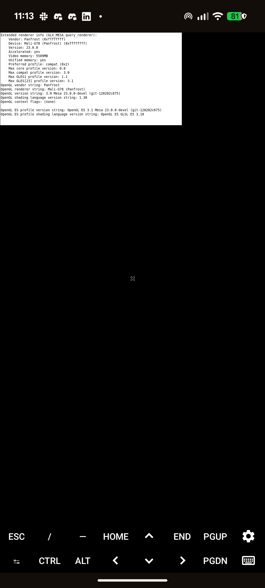
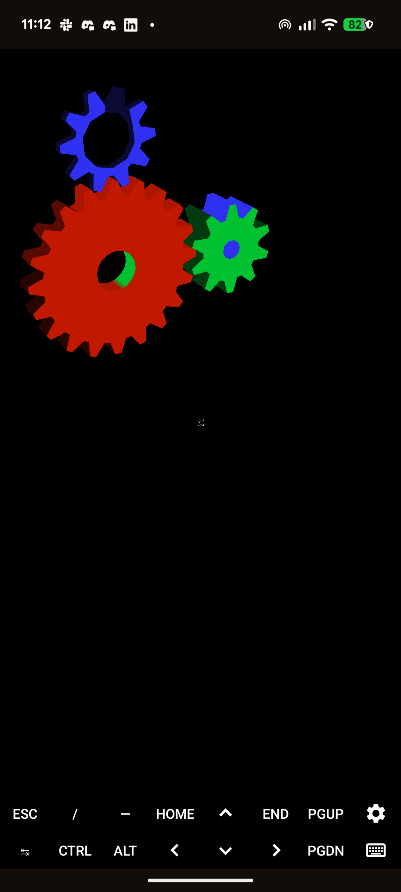
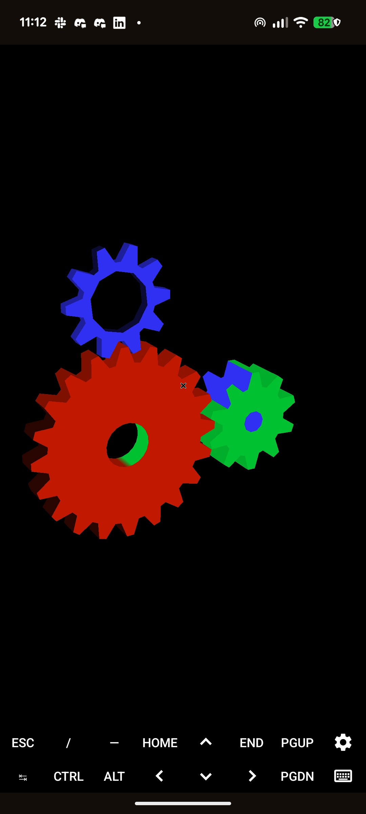

# Tensor G1 / Termux Panfrost bring-up

This directory contains an experimental userspace Panfrost port for the
Mali-G78 MP20 in Google Tensor G1. It submits jobs directly to Android's Kbase
`/dev/mali0` node; it does not replace or modify the Android kernel driver.

> [!WARNING]
> This is a device bring-up branch made from deliberately dirty, invasive
> patches. It is not an upstream-quality driver, it is not conformant, and it
> is not safe to install as the system Mesa. Keep it isolated under
> `/opt/panfork-tensor`. Basic GL works; complex games still expose rendering
> bugs.

Tested on a Pixel 6a from a uDroid Ubuntu 22.04 (Jammy) proot. Rendering is
performed by Panfrost. Window presentation uses a CPU copy into X11 because
Termux:X11 cannot import Kbase allocations as DRM dma-bufs. VirGL and ANGLE are
not used.

## Proof of hardware rendering

`glxinfo -B` reports the real Tensor GPU and Panfrost renderer:



Stock Jammy `glxgears` renders through the same GLX/X11 bridge:

| Windowed | Fullscreen |
| --- | --- |
|  |  |

The Android status/navigation bars and Termux:X11 extra-keys bar are visible in
the captures because these are unedited `adb screencap` images from the Pixel
6a.

## How this works

There are two separate paths:

1. **Rendering:** Mesa opens Android's existing Kbase character device
   (`/dev/mali0`) and submits Mali Job Manager atoms directly. Panfrost compiles
   shaders and allocates all GPU buffers. This is hardware rendering, not
   llvmpipe.
2. **Presentation:** Termux:X11 cannot import these Kbase allocations as DRM
   dma-bufs. The patched DRI software-presentation frontend maps the completed
   linear Panfrost display target on the CPU and sends it to X11 with
   `xcb_put_image`. Large frames are split to respect XCB's maximum request
   size.

`LIBGL_ALWAYS_SOFTWARE=1` therefore has a misleading name here. It selects the
DRI software *presentation frontend*, which this branch then hijacks to create
a Panfrost screen on `/dev/mali0`. `GL_RENDERER` is the source of truth and must
report `Mali-G78 (Panfrost)`.

### Dirty patch inventory

These changes intentionally cut across Mesa layers instead of adding a clean
Android/Kbase winsys:

- `platform_surfaceless.c` opens the device named by `PAN_MALI_DEV`, uses a
  software EGL device only for bookkeeping, and force-loads `panfrost_dri.so`.
- `platform_x11.c`, `drisw.c`, `drisw_glx.c`, and the DRI target route the
  swrast loader into a real Panfrost `pipe_screen` when
  `PAN_MALI_X11_SWRAST=1`, then CPU-copy frames into X11.
- Panfrost display targets are forced linear because the CPU presenter cannot
  interpret tiled layouts.
- The Mali-G78 product ID (`0x9202`, `TBOx`) is added locally. AFBC is disabled
  for it because this old fork's G78 AFBC path triggers Kbase
  `DATA_INVALID_FAULT` (`0x58`).
- The Kbase Job Manager shim serialises submissions, fixes its completion
  watermark, and drains outstanding atoms before its 8-bit atom IDs wrap.
- Valhall command-stream fixes fill the varying shader's complete resource,
  FAU, and TLS environment; separate fixed-varying packet bytes from generic
  attribute stride; zero rounded FAU tails; and correct the primary shader
  program bits.
- The shared tiler heap starts at its real base. The fork-only `base + 64`
  bottom pointer corrupted later geometry after fully culled draws.
- A few DRI damage paths gain null-resource guards required by the repurposed
  software frontend.

The result is useful as a research/prototyping driver, but the environment
variable switches, fake software-device bookkeeping, full-frame CPU copies,
device-specific quirks, and hard-coded aarch64 install layout all need proper
design work before anything could be proposed upstream.

## Build in Jammy

Install Mesa's normal build dependencies. GLX additionally requires
`libxcb-glx0-dev`. Configure with:

```sh
meson setup build-tensor \
  -Dgallium-drivers=panfrost \
  -Dvulkan-drivers= \
  -Dplatforms=x11 \
  -Dglx=dri \
  -Dshared-glapi=enabled \
  -Degl=enabled \
  -Dllvm=disabled \
  -Dbuildtype=debugoptimized \
  -Dprefix=/opt/panfork-tensor
ninja -C build-tensor -j1 install
```

The single-job build is deliberate on Android devices with limited available
memory.

Build the bounded verification programs:

```sh
cc -O2 -Wall -Wextra \
  -I/opt/panfork-tensor/include tensor-g1/egl-smoke.c \
  -L/opt/panfork-tensor/lib/aarch64-linux-gnu \
  -Wl,-rpath,/opt/panfork-tensor/lib/aarch64-linux-gnu \
  -lEGL -lGLESv2 -o egl-smoke

cc -O2 -Wall -Wextra \
  -I/opt/panfork-tensor/include tensor-g1/egl-x11-smoke.c \
  -L/opt/panfork-tensor/lib/aarch64-linux-gnu \
  -Wl,-rpath,/opt/panfork-tensor/lib/aarch64-linux-gnu \
  -lEGL -lGLESv2 -lX11 -o egl-x11-smoke

cc -O2 -Wall -Wextra \
  -I/opt/panfork-tensor/include tensor-g1/glx-x11-smoke.c \
  -L/opt/panfork-tensor/lib/aarch64-linux-gnu \
  -Wl,-rpath,/opt/panfork-tensor/lib/aarch64-linux-gnu \
  -lGL -lX11 -o glx-x11-smoke

cc -O2 -Wall -Wextra \
  -I/opt/panfork-tensor/include tensor-g1/egl-x11-triangle.c \
  -L/opt/panfork-tensor/lib/aarch64-linux-gnu \
  -Wl,-rpath,/opt/panfork-tensor/lib/aarch64-linux-gnu \
  -lEGL -lGLESv2 -lX11 -o egl-x11-triangle

cc -O2 -Wall -Wextra \
  -I/opt/panfork-tensor/include tensor-g1/glx-x11-triangle.c \
  -L/opt/panfork-tensor/lib/aarch64-linux-gnu \
  -Wl,-rpath,/opt/panfork-tensor/lib/aarch64-linux-gnu \
  -lGL -lX11 -o glx-x11-triangle
```

## Run

The surfaceless test does not require a display:

```sh
tensor-g1/run-panfrost ./egl-smoke
```

Start Termux:X11 on display `:0` before running windowed applications, then
use the X11 wrapper:

```sh
tensor-g1/run-panfrost-x11 ./egl-x11-smoke
tensor-g1/run-panfrost-x11 ./glx-x11-smoke
tensor-g1/run-panfrost-x11 ./egl-x11-triangle
tensor-g1/run-panfrost-x11 ./glx-x11-triangle
tensor-g1/run-panfrost-x11 your-application
```

For the current desktop-GL smoke targets:

```sh
apt-get install glmark2 mesa-utils
tensor-g1/run-panfrost-x11 glxgears
tensor-g1/run-panfrost-x11 glmark2 -s 300x300 \
  -b build:duration=5.0:use-vbo=true
tensor-g1/run-panfrost-x11 glmark2 --validate
```

The X11 wrapper sets `LIBGL_ALWAYS_SOFTWARE=1` only to select Mesa's software
presentation frontend. The patched frontend opens `/dev/mali0` and creates a
Panfrost renderer; `GL_RENDERER` must still report `Mali-G78 (Panfrost)`.

For the currently safer diagnostic mode, serialise GPU work:

```sh
PAN_MESA_DEBUG=sync tensor-g1/run-panfrost-x11 glxgears
```

This costs performance. An unsynchronised windowed glxgears run rendered
correctly and reached roughly 169--181 FPS, but also printed intermittent Kbase
atom event `0x58`. The synchronised fullscreen capture ran roughly 69--85 FPS
without that event. The asynchronous path is therefore not yet considered
stable.

The important environment variables are:

```sh
DISPLAY=:0
PAN_MALI_DEV=/dev/mali0
PAN_MALI_X11_SWRAST=1
MESA_LOADER_DRIVER_OVERRIDE=panfrost
LIBGL_ALWAYS_SOFTWARE=1
LD_LIBRARY_PATH=/opt/panfork-tensor/lib/aarch64-linux-gnu
LIBGL_DRIVERS_PATH=/opt/panfork-tensor/lib/aarch64-linux-gnu/dri
```

## Verified status

- Surfaceless EGL/GLES renders and reads back the expected pixel.
- EGL/GLES creates a visible Termux:X11 window and reports OpenGL ES 3.1.
- GLX creates a desktop OpenGL context and reports OpenGL 3.0.
- Both window paths report `Mali-G78 (Panfrost)` and present through the
  CPU-copy X11 bridge.
- A GLES2 triangle with a vertex-to-fragment color varying completes and reads
  back the expected pixel.
- A GLX fixed-function triangle with depth, lighting, normals, and indexed
  drawing completes and reads back the expected pixel.
- Stock Jammy `glxgears` renders visibly without the intermittent white gear
  sectors. Pre-swap GPU readback found zero near-white pixels in 40 consecutive
  instrumented frames, including the formerly failing fully culled draw path.
  A final unmodified run measured about 151--172 FPS on the test Pixel 6a.
- `glmark2` reports OpenGL 3.0 and `Mali-G78 (Panfrost)`. Its VBO build scene
  measured 168 FPS at 300x300. Every scene for which glmark2 2021.02 ships a
  validation reference passed; the advanced `ideas`, `jellyfish`, `terrain`,
  `shadow`, and `refract` scenes also completed without a GPU fault.
- A complete default fullscreen glmark2 run at the Termux:X11 display size
  (1080x2008) completed all 33 scenes with a score of 59. The 300x300 advanced
  smoke group scored 105.
- Khronos VK-GL-CTS 3.2.8.0 targeted smoke groups passed 95/95 cases: 44
  GLES3, 41 GLES2, and 10 EGL. This is deliberately small coverage, not a
  conformance claim.
- G78 AFBC is disabled in this branch. The older AFBC path produced Kbase
  `DATA_INVALID_FAULT` (`0x58`) even for a simple clear.
- Valhall varying shaders now receive the complete shader environment
  (resources, FAU/uniforms, and thread storage). Previously the v9 malloc-IDVS
  descriptor set only the secondary shader pointer, causing every draw with a
  vertex-to-fragment varying to fail with Kbase `DATA_INVALID_FAULT` (`0x58`).
- The Valhall malloc-IDVS allocation now separates fixed varyings in the
  vertex packet from generic varying attribute stride. This avoids fixed-color
  data being interpreted with a generic attribute stride.
- The shared tiler heap starts at its actual base, matching upstream Mesa.
  This reverts the fork-only `base + 64` bottom pointer that corrupted earlier
  lit geometry when a later IDVS draw was completely removed by face culling.

## Known failures and limitations

- **SuperTuxKart 1.3 is not rendered correctly.** It starts, identifies
  `OpenGL ES 3.1` and `Mali-G78 (Panfrost)`, compiles its shaders, and renders
  sky/UI/headlights. Most track and kart surfaces are nevertheless black.
  Disabling dynamic lights, IBL, shadows, SSAO, bloom, glow, depth of field,
  motion blur, and other post-effects does not fix it. That makes a single
  deferred-lighting effect unlikely; complex material multi-texture/sampler,
  UBO, or varying state remains suspect. No exact root cause is claimed yet.
- The asynchronous Job Manager path can still report atom event `0x58` during
  longer GLX workloads. Use `PAN_MESA_DEBUG=sync` when correctness matters.
- Presentation is a full-frame CPU copy. It adds latency, consumes CPU and
  memory bandwidth, and cannot match a dma-buf/direct-scanout path.
- G78 AFBC is disabled; swap control is deferred; resizing, suspend/resume,
  multisampling, audio integration, input devices, long stability runs, and a
  complete desktop session remain incomplete.
- `MESA-LOADER: failed to retrieve device information` is expected because
  `/dev/mali0` is Kbase, not a DRM render node.

This branch demonstrates that a Termux/proot process can render on Tensor G1's
Mali-G78 with an open Panfrost userspace stack. It does not yet demonstrate a
general-purpose gaming driver.
