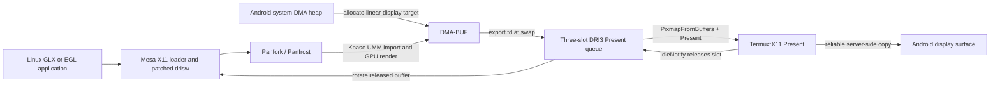

# Tensor G1 / Termux Panfrost bring-up

This directory contains an experimental userspace Panfrost port for the
Mali-G78 MP20 in Google Tensor G1. It submits jobs directly to Android's Kbase
`/dev/mali0` node; it does not replace or modify the Android kernel driver.

This document covers the open-source OpenGL path. The rootless Android
MediaCodec bridge is documented in
[`media-codec/README.md`](media-codec/README.md), and the separate proprietary
Vulkan integration is documented in
[`vulkan-wrapper/README.md`](vulkan-wrapper/README.md). The unfinished
Box64/Steam compatibility experiments are recorded in
[`box64/README.md`](box64/README.md).

> [!WARNING]
> This is a device bring-up branch made from deliberately dirty, invasive
> patches. It is not an upstream-quality driver, it is not conformant, and it
> is not safe to install as the system Mesa. Keep it isolated under
> `/opt/panfork-tensor`. Basic GL works; complex games still expose rendering
> bugs.

Tested on a Pixel 6a from a uDroid Ubuntu 22.04 (Jammy) proot. Rendering is
performed by Panfrost. The GLX and X11 EGL window paths allocate linear display
targets from Android's DMA heap, import them into Kbase, and present the same
DMA-BUF to Termux:X11 through a three-slot DRI3 Present queue. Released buffers
are rotated back into Mesa instead of being allocated and imported again.
VirGL and ANGLE are not used.

## Proof of hardware rendering

`glxinfo -B` reports the real Tensor GPU and Panfrost renderer:


Stock Jammy `glxgears` renders through the same GLX/X11 bridge:

| Windowed | Fullscreen |
| --- | --- |
|  |  |

The Android status/navigation bars and Termux:X11 extra-keys bar are visible in
the captures because these are unedited `adb screencap` images from the Pixel
6a.

## How this works



There are two separate paths:

1. **Rendering:** Mesa opens Android's existing Kbase character device
   (`/dev/mali0`) and submits Mali Job Manager atoms directly. Panfrost compiles
   shaders and allocates all GPU buffers. This is hardware rendering, not
   llvmpipe.
2. **X11 presentation:** Native Kbase allocations cannot be exported as DMA-BUFs,
   so display targets are instead allocated from `/dev/dma_heap/system` and
   imported into Kbase. At swap, the patched DRI software-presentation frontend
   exports that imported buffer and hands it to Termux:X11 with DRI3 1.2
   `PixmapFromBuffers` and Present. The reliable mode requests a server-side
   copy, allows up to three pixmaps to remain in flight, and rotates a backing
   resource into the next frame only after Present reports it idle.
   `PAN_MALI_X11_DRI3=0` restores the older CPU readback/upload fallback.

The optional [AHardwareBuffer presentation path](ahardwarebuffer/README.md)
replaces the ordinary DMA-heap display target with a broker-owned Android
buffer. Mesa still imports its data DMA-BUF into Kbase, but Termux:X11 receives
the complete gralloc handle through its existing private DRI3 socket modifier.
This makes the source eligible for Android GPU blitting while keeping the route
rootless. It remains opt-in with `PAN_MALI_X11_AHB=1`.

`LIBGL_ALWAYS_SOFTWARE=1` therefore has a misleading name here. It selects the
DRI software *presentation frontend*, which this branch then hijacks to create
a Panfrost screen on `/dev/mali0`. `GL_RENDERER` is the source of truth and must
report `Mali-G78 (Panfrost)`.

### Dirty patch inventory

These changes intentionally cut across Mesa layers instead of adding a clean
Android/Kbase winsys:

- `platform_surfaceless.c` opens the device named by `PAN_MALI_DEV`, records a
  non-DRM Kbase hardware device for EGL bookkeeping, and loads
  `panfrost_dri.so` through this fork's swrast-loader ABI. The ABI supplies
  CPU-addressable surfaces; the selected renderer remains Panfrost.
- `platform_x11.c` uses the same non-DRM Kbase EGL device when its repurposed
  software-presentation frontend is backed by Panfrost. This prevents clients
  such as Firefox from classifying the renderer as
  `EGL_MESA_device_software`.
- `platform_x11.c`, `drisw.c`, `drisw_glx.c`, and the DRI target route the
  swrast loader into a real Panfrost `pipe_screen` when
  `PAN_MALI_X11_SWRAST=1`.
- The swrast loader ABI has a private v7 callback that exports a Gallium display
  target as a DMA-BUF and presents it with DRI3/Present. It also reports the
  assigned Present slot and released-slot mask so Gallium can maintain a small
  reusable resource pool. This deliberately crosses the Gallium/GLX loader
  boundary.
- Panfrost display targets use `/dev/dma_heap/system` when
  `PAN_MALI_X11_DRI3=1`; Kbase imports those allocations through its existing
  UMM path. With `PAN_MALI_X11_AHB=1`, a native Bionic broker instead allocates
  and pools AHardwareBuffers, gives Mesa their data DMA-BUFs, and serves their
  full native handles to Termux:X11 at Present time. The ordinary Kbase
  allocator remains the fallback for other resources.
- DMA-heap allocation is activated only when the loader advertises the private
  callback. Both the GLX and X11 EGL swrast loaders now implement it; setting
  `PAN_MALI_X11_DRI3=0` retains the CPU presenter as a diagnostic fallback.
- The normal DRI image extension gate assumes a DRM fd and disables DMA-BUF
  import on `/dev/mali0`. `PAN_MALI_DMABUF_IMPORT=1` overrides that gate for
  the standalone EGL/DRI3 verification probe.
- Panfrost display targets are forced linear because the CPU presenter cannot
  interpret tiled layouts.
- The Mali-G78 product ID (`0x9202`, `TBOx`) is added locally. AFBC is disabled
  for it because this old fork's G78 AFBC path triggers Kbase
  `DATA_INVALID_FAULT` (`0x58`).
- The Kbase Job Manager shim serialises submissions, fixes its completion
  watermark, and drains outstanding atoms before its 8-bit atom IDs wrap.
- `PAN_MESA_DEBUG=batchsync` keeps vertex/tiler and fragment atoms asynchronous
  within a batch, then waits once for the completed batch. It is an experimental
  middle ground between fully asynchronous submission and per-atom `sync`.
- Android denies the `kcmp(KCMP_FILE)` identity check to Termux. The Kbase
  DMA-BUF import cache falls back to matching `fstat` device/inode identity so
  repeated Firefox imports reuse an existing Kbase handle.
- Valhall command-stream fixes fill the varying shader's complete resource,
  FAU, and TLS environment; include fixed-function color/lighting slots in both
  the vertex packet and per-vertex attribute stride; zero rounded FAU tails;
  and correct the primary shader program bits.
- The shared tiler heap starts at its real base. The fork-only `base + 64`
  bottom pointer corrupted later geometry after fully culled draws.
- A few DRI damage paths gain null-resource guards required by the repurposed
  software frontend.

The result is useful as a research/prototyping driver, but the environment
variable switches, non-DRM EGL bookkeeping device, private loader ABI,
fixed-size Present queue, device-specific quirks, and hard-coded aarch64
install layout all need proper design work before anything could be proposed
upstream.

## Build in Jammy

Install Mesa's normal build dependencies. GLX additionally requires
`libxcb-glx0-dev`. Configure with:

```sh
meson setup build-tensor \
  -Dgallium-drivers=panfrost \
  -Dvulkan-drivers= \
  -Dplatforms=x11 \
  -Dglx=dri \
  -Dshared-glapi=enabled \
  -Degl=enabled \
  -Dllvm=disabled \
  -Dbuildtype=debugoptimized \
  -Dprefix=/opt/panfork-tensor
ninja -C build-tensor -j1 install
```

The single-job build is deliberate on Android devices with limited available
memory.

Build the bounded verification programs:

```sh
cc -O2 -Wall -Wextra \
  -I/opt/panfork-tensor/include tensor-g1/panfork/egl-smoke.c \
  -L/opt/panfork-tensor/lib/aarch64-linux-gnu \
  -Wl,-rpath,/opt/panfork-tensor/lib/aarch64-linux-gnu \
  -lEGL -lGLESv2 -o egl-smoke

cc -O2 -Wall -Wextra \
  -I/opt/panfork-tensor/include tensor-g1/desktop/surfaceless-probe.c \
  -L/opt/panfork-tensor/lib/aarch64-linux-gnu \
  -Wl,-rpath,/opt/panfork-tensor/lib/aarch64-linux-gnu \
  -lEGL -lGLESv2 -o surfaceless-probe

cc -O2 -Wall -Wextra \
  -I/opt/panfork-tensor/include tensor-g1/panfork/egl-x11-smoke.c \
  -L/opt/panfork-tensor/lib/aarch64-linux-gnu \
  -Wl,-rpath,/opt/panfork-tensor/lib/aarch64-linux-gnu \
  -lEGL -lGLESv2 -lX11 -o egl-x11-smoke

cc -O2 -Wall -Wextra \
  -I/opt/panfork-tensor/include tensor-g1/panfork/glx-x11-smoke.c \
  -L/opt/panfork-tensor/lib/aarch64-linux-gnu \
  -Wl,-rpath,/opt/panfork-tensor/lib/aarch64-linux-gnu \
  -lGL -lX11 -o glx-x11-smoke

cc -O2 -Wall -Wextra \
  -I/opt/panfork-tensor/include tensor-g1/panfork/glx-x11-bc3.c \
  -L/opt/panfork-tensor/lib/aarch64-linux-gnu \
  -Wl,-rpath,/opt/panfork-tensor/lib/aarch64-linux-gnu \
  -lGL -lX11 -o glx-x11-bc3

cc -O2 -Wall -Wextra \
  -I/opt/panfork-tensor/include tensor-g1/panfork/egl-x11-triangle.c \
  -L/opt/panfork-tensor/lib/aarch64-linux-gnu \
  -Wl,-rpath,/opt/panfork-tensor/lib/aarch64-linux-gnu \
  -lEGL -lGLESv2 -lX11 -o egl-x11-triangle

cc -O2 -Wall -Wextra \
  -I/opt/panfork-tensor/include tensor-g1/panfork/glx-x11-triangle.c \
  -L/opt/panfork-tensor/lib/aarch64-linux-gnu \
  -Wl,-rpath,/opt/panfork-tensor/lib/aarch64-linux-gnu \
  -lGL -lX11 -o glx-x11-triangle

cc -O2 -Wall -Wextra \
  -I/opt/panfork-tensor/include tensor-g1/panfork/egl-dmabuf-dri3.c \
  -L/opt/panfork-tensor/lib/aarch64-linux-gnu \
  -Wl,-rpath,/opt/panfork-tensor/lib/aarch64-linux-gnu \
  -lEGL -lGLESv2 $(pkg-config --cflags --libs xcb xcb-dri3 xcb-present) \
  -o egl-dmabuf-dri3
```

## Run

The surfaceless test does not require a display:

```sh
tensor-g1/panfork/run-panfrost ./egl-smoke
tensor-g1/panfork/run-panfrost ./surfaceless-probe
```

Start Termux:X11 on display `:0` before running windowed applications, then
use the X11 wrapper:

```sh
tensor-g1/panfork/run-panfrost-x11 ./egl-x11-smoke
tensor-g1/panfork/run-panfrost-x11 ./glx-x11-smoke
tensor-g1/panfork/run-panfrost-x11 ./egl-x11-triangle
tensor-g1/panfork/run-panfrost-x11 ./glx-x11-triangle
PAN_MESA_DEBUG=sync tensor-g1/panfork/run-panfrost-x11 ./glx-x11-bc3
tensor-g1/panfork/run-panfrost-x11 your-application
```

The standalone transport probe can be run with the same environment:

```sh
tensor-g1/panfork/run-panfrost-x11 ./egl-dmabuf-dri3
```

It renders into a DMA-heap buffer through Panfork, imports that buffer into
Termux:X11 with DRI3, and prints `PASS`. `--readback` intentionally exercises a
known-unsafe imported-buffer CPU cache-sync path and is not part of the normal
test.

The BC3 probe uploads one known opaque-red DXT5 block and reads its centre
pixel back. The expected result is `pixel: 255 0 0 255`.

For the current desktop-GL smoke targets:

```sh
apt-get install glmark2 mesa-utils
tensor-g1/panfork/run-panfrost-x11 glxgears
tensor-g1/panfork/run-panfrost-x11 glmark2 -s 300x300 \
  -b build:duration=5.0:use-vbo=true
tensor-g1/panfork/run-panfrost-x11 glmark2 --validate
```

The X11 wrapper sets `LIBGL_ALWAYS_SOFTWARE=1` only to select Mesa's software
presentation frontend. The patched frontend opens `/dev/mali0`, creates a
Panfrost renderer, and uses the private DMA-BUF callback for presentation;
`GL_RENDERER` must still report `Mali-G78 (Panfrost)`.

For the currently safer diagnostic mode, serialise GPU work:

```sh
PAN_MESA_DEBUG=sync tensor-g1/panfork/run-panfrost-x11 glxgears
```

For lower wait overhead while retaining one completion check per full Job
Manager batch:

```sh
PAN_MESA_DEBUG=batchsync tensor-g1/panfork/run-panfrost-x11 glxgears
```

This costs performance. An unsynchronised windowed glxgears run rendered
correctly and reached roughly 169--181 FPS, but also printed intermittent Kbase
atom event `0x58`. The synchronised fullscreen capture ran roughly 69--85 FPS
without that event. The asynchronous path is therefore not yet considered
stable.

The important environment variables are:

```sh
DISPLAY=:0
PAN_MALI_DEV=/dev/mali0
PAN_MALI_X11_SWRAST=1
PAN_MALI_X11_DRI3=1
PAN_MALI_X11_AHB=0
PAN_MALI_DMABUF_IMPORT=1
MESA_LOADER_DRIVER_OVERRIDE=panfrost
LIBGL_ALWAYS_SOFTWARE=1
LD_LIBRARY_PATH=/opt/panfork-tensor/lib/aarch64-linux-gnu
LIBGL_DRIVERS_PATH=/opt/panfork-tensor/lib/aarch64-linux-gnu/dri
```

## GNOME desktop and native ARM64 Firefox

The `desktop/` wrappers run GNOME Shell and Mozilla's native aarch64 Firefox
through the same isolated Panfrost install:

```sh
install -Dm644 tensor-g1/desktop/firefox-user.js \
  /root/.mozilla/firefox/panfrost-profile/user.js
mkdir -p /opt/firefox-glxtest-stub
cc -shared -fPIC -Wl,-soname,libpci.so.3 \
  tensor-g1/desktop/glxtest-no-pci.c \
  -o /opt/firefox-glxtest-stub/libpci.so.3
ln -sf libpci.so.3 /opt/firefox-glxtest-stub/libpci.so
tensor-g1/desktop/start-gnome-x11
tensor-g1/desktop/run-firefox-panfrost about:support
tensor-g1/desktop/run-epiphany-panfrost --private-instance \
  file:///tmp/video-loop.html
```

Japanese, Chinese, and Korean page text needs a CJK font inside the otherwise
minimal Jammy container. Without one, Firefox tabs and GNOME window titles show
square replacement glyphs. Install Noto CJK, refresh Fontconfig, and restart
GNOME Shell and Firefox so both processes discard their old font caches:

```sh
apt-get update
apt-get install -y --no-install-recommends fonts-noto-cjk
fc-cache -f
fc-match :lang=ja
# NotoSansCJK-Regular.ttc: "Noto Sans CJK JP" "Regular"
```

GNOME Shell and Epiphany deliberately retain the conservative
`PAN_MALI_X11_DRI3=0` and `PAN_MALI_DMABUF_IMPORT=0` defaults. Their final
windows are CPU-presented while rendering stays on Mali-G78. Firefox enables
`PAN_MALI_X11_DRI3=1` because its hardware-video path must use X11 EGL: stock
Firefox disables DMA-BUF and VA-API when EGL is disabled. This fork's EGL
swrast loader now supplies the same reusable DMA-BUF/DRI3 Present queue as the
GLX loader, replacing the CPU-upload fallback that left Firefox windows
unpainted under Mutter. The GNOME wrapper also removes an empty
`/run/systemd/seats` marker when no systemd process exists. Without that PRoot
guard, GNOME Shell 42 mistakes the directory installed by the systemd package
for a working logind service and aborts during background initialization.

Firefox can opt into the AHardwareBuffer display-target experiment by exporting
`PAN_MALI_X11_AHB=1` before running its wrapper. Do not enable that variable for
GNOME Shell itself: Mutter currently reaches the separate imported-BO CPU-map
failure and exits with `SIGBUS`. Build, launch, and diagnostic instructions are
in [`ahardwarebuffer/README.md`](ahardwarebuffer/README.md).

Android exposes `/sys/bus/pci` but not `/proc/bus/pci/devices` inside PRoot.
Firefox's short-lived graphics test consequently exits inside libpci before it
can test the GPU. Build `glxtest-no-pci.c` as `libpci.so.3` and install it only
under `/opt/firefox-glxtest-stub`; the Firefox wrapper prepends that directory
to its own `LD_LIBRARY_PATH`. The deliberately empty shim makes Firefox treat
PCI discovery as unavailable and continue to the real EGL test. Do not install
it system-wide.

With that shim, Firefox's probe exits successfully with `TEST_TYPE EGL`,
`DRI_DRIVER panfrost`, and `Mali-G78 (Panfrost)`. `about:support` reports
WebRender, `mesa/panfrost`, and Panfrost for both WebGL versions. The wrapper
retains Firefox-only OpenGL 3.2/GLSL 1.50 overrides for compositor paths that
request a 3.2 core context. Do not export them globally.

Firefox now reaches the experimental Tensor VA-API driver without a custom
browser build. Mesa reports accessible Kbase `/dev/mali0` as the compatibility
device carrier, Firefox's stock probe reports H.264 hardware support, and its
RDD process decodes local H.264 through Android MediaCodec. The Panfrost-backed
`drisw` frontend now publishes Mesa's full DRI image extension when
`PAN_MALI_DMABUF_IMPORT=1`; this lets Firefox import the exported NV12 R8 and
GR88 planes as EGLImages in both RDD and the parent renderer. VA-API mode turns
that opt-in on automatically and ends the DMA-BUF CPU-write epoch before the
GPU samples a decoded frame. Firefox remains on X11 EGL, as required by its
stock VA-API feature gate, while the new EGL DRI3 presenter displays its final
swaps. The tested 1920x1080 60 FPS H.264 pattern painted visibly while playing
in stock Firefox. The RDD sandbox currently must be disabled per launch. The
implementation and remaining copy boundary are documented in
[`media-codec/README.md`](media-codec/README.md).

For streaming H.264, Exynos Codec2 withholds the first output until later
access units are queued, while Firefox tries to export that first VA surface
immediately. The Firefox wrapper now enables the VA frontend's deferred-export
mode: it exports a preinitialized DMA-BUF, matches delayed output by PTS, and
normalizes changing MediaCodec row pitches into the immutable exported layout.
The tested Yorushika YouTube stream stayed on hardware decode across its
640x368-to-864x480 adaptive transition for 4,672 frames with no sync/export
failure, decoder fallback, or GPU timeout. This is intentionally a dirty
rootless workaround, not an upstream-quality explicit-fence implementation.

GNOME Web can use that bridge. WebKitGTK's DMA-BUF renderer must be disabled
because it assumes a DRM/GBM device, while this port exposes Kbase
`/dev/mali0`. `run-epiphany-panfrost` scopes that workaround and WebKit's
PRoot sandbox exception to GNOME Web. WebKit accelerated composition remains
enabled: the tested browser visibly painted the 1080p60 test pattern through
Panfrost while GStreamer selected `tensorh264dec` and Android selected
`c2.exynos.h264.decoder`.

## Verified status

- Surfaceless EGL/GLES renders and reads back the expected pixel.
- EGL/GLES creates a visible Termux:X11 window and reports OpenGL ES 3.1.
- GLX creates a desktop OpenGL context and reports OpenGL 3.0.
- GLX reports `Mali-G78 (Panfrost)` while rendering directly into a DMA-heap
  buffer imported by Kbase. The same DMA-BUF is accepted by Termux:X11 through
  DRI3 1.2 and visibly presented by stock Jammy `glxgears`.
- This DRI3 route removes Panfork's client-side framebuffer map/readback and
  XImage/MIT-SHM upload. Termux:X11 currently performs the final Present copy;
  its log reported that these copies were not GPU-offloaded on the tested
  build. GLX now pipelines three Present pixmaps and recycles their DMA-heap
  resources only after `IdleNotify`, avoiding per-frame DMA-heap allocation and
  Kbase import.
- A GLES2 triangle with a vertex-to-fragment color varying completes and reads
  back the expected pixel.
- A GLX fixed-function triangle with depth, lighting, normals, and indexed
  drawing completes and reads back the expected pixel.
- Stock Jammy `glxgears` renders visibly without the intermittent white gear
  sectors. Pre-swap GPU readback found zero near-white pixels in 40 consecutive
  instrumented frames, including the formerly failing fully culled draw path.
  A 20-second 640x480 run with the pipelined presenter measured about 236--274
  FPS on the test Pixel 6a.
- `glmark2` reports OpenGL 3.0 and `Mali-G78 (Panfrost)`. Its VBO build scene
  measured 168 FPS at 300x300 on the older presenter. The DMA-BUF/DRI3 path
  completed the same five-second scene at 640x480 with clean-exit results of
  225--257 FPS using the original wait-per-frame presenter. The pooled
  three-slot queue reached 269 FPS in a standalone run; a build, texture,
  Gouraud-shading, and high-poly-bump transition group completed at 293, 277,
  273, and 228 FPS respectively, scoring 267. Every scene for which glmark2
  2021.02 ships a validation reference passed; the advanced `ideas`,
  `jellyfish`, `terrain`, `shadow`, and `refract` scenes also completed without
  a GPU fault.
- A complete default fullscreen glmark2 run at the Termux:X11 display size
  (1080x2008) completed all 33 scenes with a score of 59. The 300x300 advanced
  smoke group scored 105.
- SuperTuxKart 1.3 renders the tutorial track correctly with its normal HD and
  texture-compression options enabled. Tensor G1's raw GPU properties claim
  BCn support, but a known-good BC3 block samples as opaque black when passed
  to the G78 texture unit. The driver therefore rejects native S3TC for this
  GPU ID; Mesa's state tracker decompresses BC textures once during upload and
  Panfrost samples the resulting RGBA textures in hardware. The dedicated BC3
  probe reads back the expected opaque red pixel after this fallback.
- Khronos VK-GL-CTS 3.2.8.0 targeted smoke groups passed 95/95 cases: 44
  GLES3, 41 GLES2, and 10 EGL. This is deliberately small coverage, not a
  conformance claim.
- Surfaceless EGL now uses the explicit Kbase device even though the wrapper
  sets `LIBGL_ALWAYS_SOFTWARE=1`; `surfaceless-probe` reports EGL 1.4 and
  `Mali-G78 (Panfrost)` through the swrast-loader ABI.
- Firefox's EGL probe completes and `about:support` reports WebRender and
  `mesa/panfrost` rather than a software device.
- Firefox's RDD process imports the Tensor VA-API driver's R8 and GR88 NV12
  planes into Panfrost EGLImages, sends the DMA-BUF surface through IPC, and
  the parent renderer imports both planes again. The trace reports zero-copy
  `EGLImageTargetTexture2D` success at both boundaries.
- With X11 EGL and its DRI3 presenter enabled, stock Firefox visibly paints the
  hardware-decoded 1920x1080 60 FPS test pattern together with its accelerated
  browser chrome.
- The rootless AHardwareBuffer broker supplies buffers that are simultaneously
  importable by Kbase and recognizable by Termux:X11. In the tested GNOME
  YouTube run it raised Firefox's observed Present rate from 3.8/s to 17.4/s,
  while dropped frames improved from 88.2% to 49.6%. This is a meaningful
  presentation improvement, not a claim of smooth playback.
- Android MediaCodec selected `c2.exynos.h264.decoder`; the native decoder,
  Unix-socket bridge, and Jammy GStreamer `tensorh264dec` element each decoded
  all 120 frames of the 1920x1080 60 FPS smoke stream. The GStreamer element
  delivered all 120 tightly packed NV12 frames to `fakesink`.
- G78 AFBC is disabled in this branch. The older AFBC path produced Kbase
  `DATA_INVALID_FAULT` (`0x58`) even for a simple clear.
- Valhall varying shaders now receive the complete shader environment
  (resources, FAU/uniforms, and thread storage). Previously the v9 malloc-IDVS
  descriptor set only the secondary shader pointer, causing every draw with a
  vertex-to-fragment varying to fail with Kbase `DATA_INVALID_FAULT` (`0x58`).
- The Valhall malloc-IDVS allocation now includes fixed-function varying slots
  in `vertex_attribute_stride` as well as `vertex_packet_stride`. This fixes the
  long-standing glxgears corruption where individual red, green, and blue teeth
  borrowed the wrong color or lighting data.
- The shared tiler heap starts at its actual base, matching upstream Mesa.
  This reverts the fork-only `base + 64` bottom pointer that corrupted earlier
  lit geometry when a later IDVS draw was completely removed by face culling.

## Known failures and limitations

- S3TC/BCn is not sampled natively on this Tensor G1 path. Mesa preserves the
  GL extensions through its software upload fallback, but decompressed RGBA
  textures use more memory and bandwidth than BCn. This fixes correctness for
  SuperTuxKart without claiming native compressed-texture acceleration.
- The asynchronous Job Manager path can still report atom event `0x58` during
  longer GLX workloads. `batchsync` reduces synchronization overhead but is
  still experimental; use `PAN_MESA_DEBUG=sync` when correctness matters.
- Reliable presentation still requests a full-frame copy inside Termux:X11.
  The ordinary DMA-heap source is not GPU-offloaded; the AHardwareBuffer route
  makes GPU blitting possible and is about 4.6 times faster in the recorded
  Firefox Present comparison, but Mutter plus final X11 composition still
  drops about half the frames of a 360p stream. Strict no-copy Present
  (`PAN_MALI_X11_DRI3_ZERO_COPY=1`) negotiates successfully but produces an
  invisible window under the tested GNOME/Mutter session.
- Mutter exits with `SIGBUS` if GNOME Shell's own display targets use the AHB
  route. Keep GNOME on `PAN_MALI_X11_DRI3=0` and opt individual clients into
  AHB until imported-buffer CPU mapping is fixed.
- G78 AFBC is disabled; swap control is deferred; resizing, suspend/resume,
  multisampling, audio integration, input devices, long stability runs, and a
  complete desktop session remain incomplete.
- `MESA-LOADER: failed to retrieve device information` is expected because
  `/dev/mali0` is Kbase, not a DRM render node.
- The MediaCodec bridge is H.264-only. GStreamer still receives decoded NV12
  through the Unix socket. The VA path instead registers each exportable
  DMA-heap surface with the native service through `SCM_RIGHTS`; the service
  copies Codec2's CPU-readable output directly into that surface, avoiding the
  raw-frame socket copy but not the remaining MediaCodec-to-DMA-BUF CPU copy.
  Firefox's two subsequent EGL imports are zero-copy.
- The dedicated Firefox profile disables VP9 and AV1 so YouTube requests H.264.
  The tested local low-delay file and the tested YouTube AVC stream are both
  hardware-decoded and visible. YouTube currently relies on the experimental
  deferred-export path because Exynos Codec2 holds several display-order
  outputs before returning the first frame; there is no explicit release fence
  between the later CPU write and Firefox's already-imported DMA-BUF.
- The Yorushika YouTube checkpoint visibly renders Japanese text after adding
  Noto CJK. Stats for nerds reports AVC at 640x360@24 and 909 dropped frames out
  of 4078 at capture time. Toggling the stats context action caused a roughly
  three-second stutter/hang with visual glitches before recovery. See the
  [screenshot](screenshots/firefox-youtube-stats-for-nerds.png) and
  [filtered Firefox trace](logs/firefox-youtube-yorushika-debug.txt). This is a
  diagnostic checkpoint, not a performance result.
- The Box64/Steam work remains a compatibility experiment. Guest ABI and
  Vulkan-loader probes are preserved under [`box64/`](box64/README.md), but
  Steam did not reach a usable client window and no Proton game was launched.
- GNOME Web 42.4 segfaults in GTK style-provider setup if WebKit's DMA-BUF
  renderer is enabled. Use `desktop/run-epiphany-panfrost`, which disables
  only that renderer; Panfrost composition and MediaCodec video decoding stay
  active. Epiphany session restore may reopen several Web processes and create
  avoidable memory pressure on the 6 GB test device; use `--private-instance`
  for isolated video smokes.

This branch demonstrates that a Termux/proot process can render on Tensor G1's
Mali-G78 with an open Panfrost userspace stack. It does not yet demonstrate a
general-purpose gaming driver.
