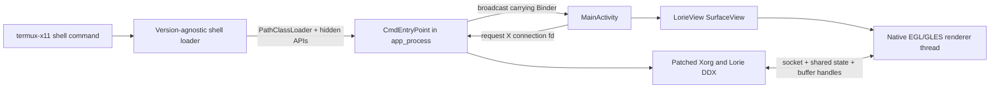
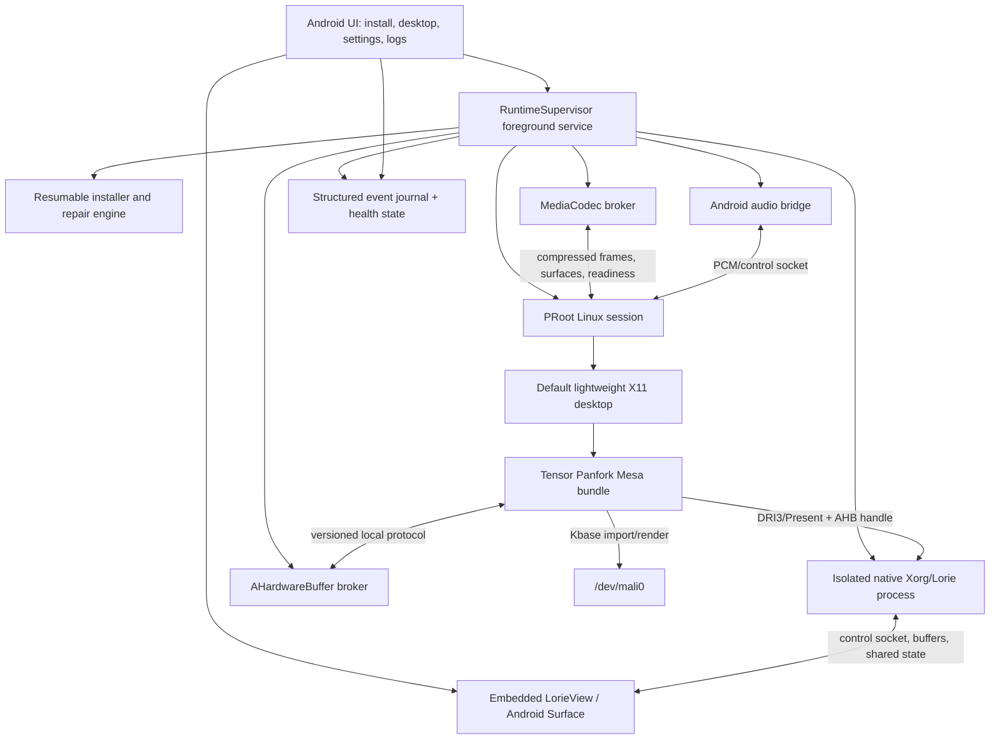
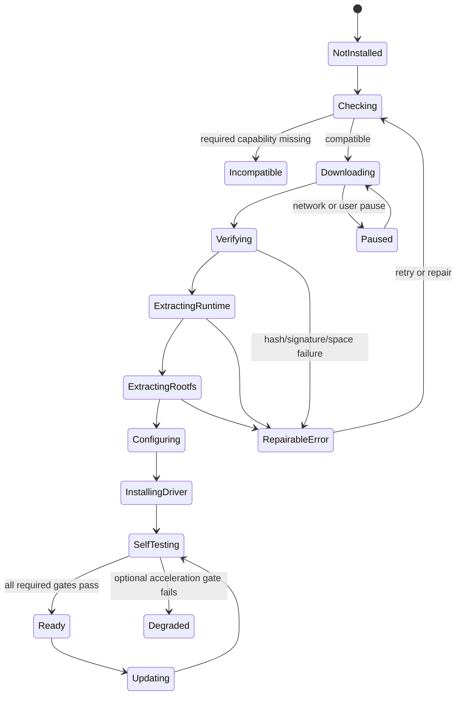
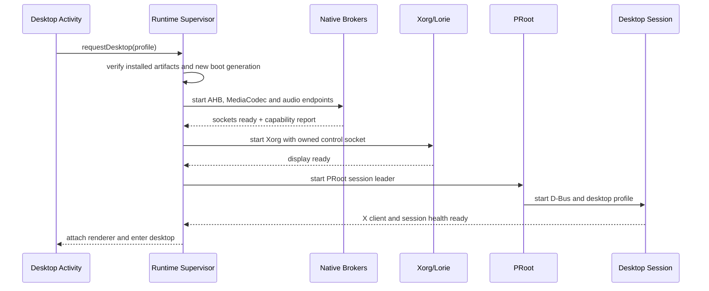

# Standalone Tensor Linux Android app plan

Status: architecture and implementation plan
Date: 2026-07-20
Initial hardware target: Google Tensor G1 / Pixel 6 and Pixel 6a
Working name: **Tensor Linux** (placeholder only)

## 1. Product decision

Build one Android application that contains the Termux-derived runtime, the
Termux:X11-derived display backend, and the Tensor G1 graphics/media bridges.
Keep the X server, Linux runtime, and Android renderer isolated in separate
processes, but place them under one APK, one Android UID, one supervisor, and
one user-facing lifecycle.

The final experience should be:

1. Install one APK.
2. Open it and pass a compatibility check.
3. Watch a resumable installation progress screen with readable logs.
4. Tap **Launch Desktop**.
5. On later launches, go directly to the desktop unless maintenance is needed.

An external-Termux companion mode can be retained as a developer tool, but it
must not be the product architecture. It would preserve the same lifecycle,
UID, path, signing, and process-kill problems that the standalone app is meant
to remove.

## 2. Source audit basis

This plan is based on full first-party source inventories and targeted control-
flow review of the following snapshots:

| Project | Audited revision | Revision date | Scope reviewed |
| --- | --- | --- | --- |
| [termux/termux-app](https://github.com/termux/termux-app/tree/3df69d1da197dd9bd71a3bafd902dffd720576b4) | `3df69d1da197dd9bd71a3bafd902dffd720576b4` | 2026-07-15 | All four Gradle modules, manifests, bootstrap installer, runtime service, command API, PTY JNI, terminal emulator/view, shared utilities, storage, settings, tests, and build configuration |
| [termux/termux-x11](https://github.com/termux/termux-x11/tree/caa7553b36c5567e19896ab6521a2cdcb8010014) | `caa7553b36c5567e19896ab6521a2cdcb8010014` | 2026-07-13 | Android activity/view/input/preferences, AIDL, shell loader, JNI boundary, Lorie/Xorg native backend, renderer, AHardwareBuffer transport, DRI3/Present, clipboard, shared memory, build recipes, and Xserver patches |
| This repository | `tensor-g1` branch | 2026-07-20 working state | Panfork/Kbase, DRI3 queue, AHB broker, Termux:X11 patches, MediaCodec service and VA driver, desktop wrappers, Vulkan experiments, Box64 notes, tests, logs, and screenshots |

Vendored Xorg, Pixman, X11, XKB, and related upstream submodules were mapped at
their Termux:X11 integration and patch boundaries. They should remain vendored
dependencies; they should not be forked further unless a required behavior
cannot live in the Lorie DDX or a small maintained patch.

## 3. What the current code actually does

### 3.1 Termux app

The Termux app is four reusable layers:

| Module | Current responsibility | Standalone-app decision |
| --- | --- | --- |
| `app` | `TermuxActivity`, bootstrap UI, foreground runtime service, command service, settings, file/document receivers | Reuse concepts and selected service code; replace the monolithic terminal-first Activity and spinner installer |
| `termux-shared` | Paths, environment, command models, shell runners, local sockets, logging, reports, settings, permissions, plugin helpers | Fork a deliberately small subset; parameterize every package/path assumption |
| `terminal-emulator` | PTY subprocess creation, terminal state machine, escape sequences, session I/O | Reuse with attribution and its tests |
| `terminal-view` | Android terminal rendering, gestures, text selection, IME integration | Reuse as an advanced console, not the primary home screen |

Important runtime behavior:

- `TermuxInstaller` embeds a bootstrap ZIP in a native library, extracts it to
  a staging prefix, creates symlinks, and atomically renames staging to the
  live prefix. The atomic-staging idea is sound, but the UI is a non-resumable
  `ProgressDialog` with no stage or byte progress.
- `TermuxService` owns interactive terminal sessions and background tasks. It
  is a foreground service, but deliberately returns `START_NOT_STICKY`.
- When the service is destroyed unexpectedly, it kills its managed commands.
  That behavior explains why a product supervisor cannot merely rename this
  service and expect desktop recovery.
- The Activity and Service use a same-process local Binder. The service can
  outlive the Activity, but no durable process graph or install state exists.
- `TerminalSession` opens `/dev/ptmx`, forks, establishes a session, and
  `execvp`s the requested command. Three Java threads read PTY output, write
  PTY input, and wait for process exit.
- `RunCommandService` is an exported, permission-protected intent API for
  external apps. A first release does not need this attack surface.
- The current app uses `android:sharedUserId`, a Termux plugin ecosystem
  compatibility mechanism that is unnecessary and undesirable in a single
  new APK.
- Current Termux builds compile with SDK 36 but target SDK 28. Executable files
  in the writable app data directory and modern Android distribution policy
  need an explicit decision; this cannot be accidentally changed during UI
  modernization.
- Termux contains diagnostics for Android phantom-process limits but cannot
  override those limits on an ordinary unrooted device.

### 3.2 Termux:X11

Termux:X11 is already two process domains and should stay that way:

1. A shell-side `app_process` entry point loads `libXlorie.so` and runs Xorg.
2. An Android Activity owns a `SurfaceView`, EGL/GLES renderer, input, IME,
   clipboard, preferences, and notification.

The installed APK and shell package currently connect through this chain:



Important rendering behavior:

- Xorg uses the Lorie DDX, EXA hooks, DRI3 v2, and a custom Present
  implementation.
- `LorieBuffer` supports regular heap memory, file-descriptor-backed shared
  memory, and `AHardwareBuffer`.
- Private DRI3 modifiers currently carry raw mappable FDs (`1274`) or request
  an AHardwareBuffer handle through a Unix socket (`1255`/`1256`).
- The renderer imports AHardwareBuffers as EGLImages, samples them with GLES2,
  draws to the Android `ANativeWindow`, and uses `AChoreographer` for frame
  pacing.
- Xorg and renderer share a memory block containing root-buffer identity,
  damage state, cursor state, a process-shared mutex, and an eight-entry GPU
  Present-copy queue. Copies with more than 16 rectangles or a full queue fall
  back to CPU copy.
- The renderer waits for an EGL fence before acknowledging a GPU Present copy,
  preventing the X client from overwriting an in-flight source.
- Android input is translated into X mouse, touch, stylus, keyboard, Unicode,
  scroll, gamepad, and pointer-capture events. XKB handling lives in the native
  server. Clipboard transfer is bidirectional.
- Resolution, scaling, filtering, fullscreen, orientation, external keyboard,
  extra keys, PiP, pointer mode, stylus behavior, and per-display preferences
  already exist and should be preserved selectively.
- Audio is not a Termux:X11 responsibility and must be added at the runtime
  integration layer.

The unified app can remove the dynamic shell loader, APK signature lookup,
hidden `ActivityThread` loading path, repeated broadcast handshake, and
dependency on a separately signed `com.termux` package. It should keep the
X-server/renderer process split and FD-based transport.

### 3.3 Tensor G1 prototype

The current branch adds three capabilities that neither upstream project
provides:

- Panfork submits directly to Android Kbase `/dev/mali0` from a glibc PRoot.
- Display targets can be allocated as AHardwareBuffers by a Bionic broker,
  imported into Kbase as DMA-BUFs, and presented through Termux:X11 modifier
  `1255`.
- A Bionic MediaCodec service exposes Tensor/Exynos H.264 decode to a Linux
  GStreamer plugin and experimental VA-API driver.

Current measured boundary after the release-fence and consumer-wait milestone:

| Path | Result |
| --- | --- |
| Producer/consumer synchronization | 0/48 early GPU samples and 0/48 finalized-pixel mismatches with the opt-in Panfrost DMA-BUF wait; 80/80 correct in the follow-up |
| VA correctness | 360/360 MediaCodec frames matched software FFmpeg byte-for-byte with clean EOS teardown |
| GNOME + Firefox, local 360p24 | Estimated 96.5% displayed cadence and 3.55% dropped frames |
| GNOME + Firefox, realistic 1080p30 before severe throttle | Approximately 28.2 displayed frames/s and 5.83% dropped frames |
| Same 1080p30 after Android thermal status 3 | 25.39 displayed frames/s and 15.28% dropped frames; little and middle CPU clusters capped |
| 1080p60 27.9 Mbit/s stress stream | At least 98.87% drops across AHB, raw DMA-BUF, and CPU-present diagnostic routes |

This separates two remaining problems:

1. AHB presentation and the dirty release-fence/consumer-wait contract now
   work, but the current Panfrost wait blocks the submitting compositor thread.
2. Normal 24/30 FPS hardware playback works, while the remaining CPU NV12 copy
   and Android thermal policy prevent native-quality sustained 1080p60.

## 4. Architecture for the standalone app



### Process model

Do not put the whole stack into one process. Use one APK/UID with these process
roles:

| Process | Responsibility | Restart policy |
| --- | --- | --- |
| Android UI | Installer/launcher screens and embedded X11 `SurfaceView` | Freely recreatable; must not own Linux lifetime |
| Runtime supervisor | Foreground service, process graph, state, notifications, locks, health checks | `START_STICKY` with persisted desired state and guarded recovery |
| Xorg/Lorie | Native X server and DRI3/Present | Restart with generation change; clients receive controlled desktop restart |
| PRoot session leader | Container, D-Bus, desktop, apps | Process group owned by supervisor; graceful stop then bounded kill |
| AHB broker | Buffer allocation/pooling and native-handle service | Restart invalidates a generation and forces display clients to recreate buffers |
| Media broker | Android MediaCodec sessions | Per-client sessions; broker survives decoder failure |
| Optional terminal PTY | Recovery shell and live logs | User-controlled; not required for desktop startup |

The Android renderer may remain a native thread in the UI process, matching
Termux:X11, while Xorg stays out-of-process. The supervisor must own the socket
pair and connection generation instead of discovering it through broadcasts.

## 5. Proposed Android project layout

Create a new repository for the app rather than turning the Mesa repository
into an Android monorepo. Import pinned driver artifacts from this repository.

```text
tensor-linux-android/
  app/                       # Compose/navigation, desktop Activity, settings
  runtime-core/              # State machine, supervisor, process graph
  runtime-installer/         # Download, verify, extract, migrate, repair
  runtime-terminal/          # Termux terminal-emulator/view integration
  runtime-proot/             # PRoot command and environment builder
  x11-android/               # LorieView, input, IME, clipboard, Surface lifecycle
  x11-native/                # Lorie DDX, renderer, Xorg patches and recipes
  tensor-brokers/            # AHB, MediaCodec, audio native services
  diagnostics/               # Probes, log journal, support bundle exporter
  artifacts/                 # Signed manifests, not large rootfs/driver binaries
  licenses/                  # Generated notices and source-offer metadata
```

Use Kotlin for new lifecycle/state/UI code. Keep proven Java terminal and X11
classes initially; migration for style alone adds risk. Use JNI/C only at
existing process, PTY, Xorg, AHB, MediaCodec, and audio boundaries.

## 6. Reuse and replacement matrix

| Existing component | Action | Reason |
| --- | --- | --- |
| Termux PTY `fork`/`exec` JNI | Reuse and harden | Small, understood, essential for console and session leader |
| `terminal-emulator` tests and engine | Reuse | Mature escape-sequence implementation |
| `terminal-view` | Reuse behind an advanced console screen | Useful recovery UI; should not dominate product UX |
| Termux bootstrap staging/rename | Reuse concept, replace implementation UI | Atomic install is good; progress and recovery are insufficient |
| `TermuxService` | Replace with `RuntimeSupervisorService` | Existing ownership and `START_NOT_STICKY` semantics are wrong for a desktop appliance |
| Termux `RunCommandService` | Exclude from v1 | Avoid unnecessary exported command execution surface |
| Termux plugin/shared UID model | Exclude | One APK does not require it; `sharedUserId` is legacy |
| Termux file/document providers | Defer | Add only when desktop file integration needs them |
| Termux:X11 `MainActivity` | Split | Keep behaviors, move lifecycle to product Activity and supervisor |
| `LorieView`, IME, input translators | Reuse and modularize | Broad device/input behavior already implemented |
| X11 shell loader and APK reflection | Remove | Same APK can use an explicit internal entrypoint and verified packaged library |
| CmdEntryPoint broadcast handshake | Replace | Supervisor can pass Binder/socket endpoints directly with generations |
| Lorie native Xorg/DDX/renderer | Reuse as maintained fork | This is the working display backend |
| Custom DRI3 modifiers | Keep initially, version and document | Required for rootless AHB handoff; private ABI must be explicit |
| Tensor AHB broker | Integrate and redesign ownership | Working path, but current 16-slot pool strands slots after abrupt client death |
| Tensor MediaCodec broker | Integrate as experimental | Hardware decode and surface timing work with dirty fences; direct AHardwareBuffer output and nonblocking consumer waits remain |
| GNOME launch wrapper | Keep as experimental profile | Mutter remains expensive and its AHB swapchain currently SIGBUSes |

## 7. First-install experience

### Installation state machine



Persist every transition and artifact version before updating UI. The Activity
must be able to die during any state and reconstruct the exact progress from
disk.

### Progress stages

Progress must be byte- or unit-based, not a simulated timer. Suggested initial
weights are only for combined presentation:

| Stage | UI weight | Measured unit |
| --- | ---: | --- |
| Compatibility and storage check | 3% | Completed probes |
| Runtime download | 12% | Bytes downloaded |
| Rootfs download | 38% | Bytes downloaded |
| Signature/hash verification | 5% | Bytes hashed |
| Runtime extraction | 8% | Archive entries/bytes |
| Rootfs extraction | 20% | Archive entries/bytes |
| Desktop/driver configuration | 8% | Idempotent tasks |
| GPU, X11, audio, and network self-tests | 6% | Completed probes |

### Installer design

- Ship a tiny native bootstrap sufficient to download, verify, and extract.
- Download a prebuilt, versioned, tested rootfs image. Do not run a large
  interactive `apt install` transaction on first launch.
- Publish a signed manifest containing app compatibility, rootfs version,
  compressed and installed sizes, hashes, driver bundle version, minimum free
  space, and migration rules.
- Support HTTP range resume and retain partial downloads across Activity death.
- Extract to a versioned staging directory. Verify required files, permissions,
  symlinks, and executable probes before an atomic activation marker/symlink.
- Keep user home data outside the versioned system root so a rootfs update does
  not replace it.
- Provide **Retry**, **Repair**, **Reset system files**, **Export logs**, and an
  explicit **Delete user data** action. Never combine the last two operations.
- Display current and projected storage before downloading. Explain rootfs,
  package cache, user home, shader cache, and logs separately.
- Begin with the already-tested Jammy image. Make distro choice a manifest
  concern so a later supported image does not require an app rewrite.

Suggested app-private layout:

```text
files/
  state/install-state.json
  runtime/<version>/
  rootfs/<image-version>/
  home/
  bundles/tensor-g1/<driver-version>/
  sockets/<runtime-generation>/
  logs/<boot-id>/
  cache/downloads/
```

## 8. Launch and shutdown flow

Launch should be an explicit dependency graph:



Do not use SSH as an internal control plane. It was useful for development but
adds keys, a daemon, another failure mode, and weak lifecycle ownership.

Shutdown order:

1. Ask desktop session to log out.
2. Terminate remaining container process group after a timeout.
3. Stop decoder sessions.
4. Disconnect X clients and stop Xorg.
5. Release AHB generation and broker pools.
6. Stop audio.
7. Close journal cleanly and release wake locks/foreground notification.

Force stop must use the same state machine with shorter timeouts. Never issue a
broad process-name kill that can match an unrelated app or a newer generation.

## 9. Logging, progress, and diagnostics

All components should write structured events to the supervisor:

```text
timestamp, boot_id, component, pid, severity, event, message, fields
```

Required component streams:

- Android lifecycle and memory callbacks.
- Installer stage, bytes, throughput, hash, and free-space changes.
- Xorg stderr and Lorie renderer diagnostics.
- Panfork/Kbase errors and Present counters.
- AHB allocate/recycle/release/generation events.
- MediaCodec component, input/output counts, PTS mapping, fallback, and errors.
- PRoot session leader, D-Bus, desktop, and application exits.
- Audio underrun/overrun counters.

The normal UI should show a concise stage and latest meaningful message. An
expandable panel can show raw logs. **Export diagnostic bundle** should produce
a redacted archive containing:

- App/runtime/rootfs/driver versions.
- Device model, Android build, kernel, GPU ID, and capability probes.
- Current settings excluding secrets.
- The latest boot journal and bounded previous journals.
- `glxinfo -B`, X11 extensions, VA capability, and self-test results.
- Memory/storage summary and process exit reasons.

Never collect browsing history, user files, clipboard content, or full media
URLs by default.

## 10. Graphics and desktop policy

### Initial default

Use a lightweight X11 desktop with composition disabled or tightly controlled
as the default. Xfce is the practical first candidate because Termux:X11
already documents it and its composition can be disabled. Theme it to provide
a cohesive product experience.

GNOME should remain an **Experimental desktop** until both are fixed:

- Mutter currently adds a major presentation cost relative to direct X.
- Mutter's own AHB-backed swapchain currently triggers SIGBUS in the tested
  imported-buffer path.

Offer a direct-application mode later for browser, terminal, media, and games;
the direct-X AHB result shows this path has substantial performance value.

### Driver bundle

- Install Panfork under an app-controlled, versioned prefix, never as the
  distro's system Mesa.
- Generate launch environments from a typed profile instead of accumulating
  shell exports in user dotfiles.
- Keep safe defaults (`PAN_MESA_DEBUG=sync`) until correctness tests authorize
  a faster submission mode.
- Make the AHB path default only after buffer recovery, resize, suspend/resume,
  and long-soak gates pass.
- Preserve a CPU-present and ordinary DMA-heap fallback for diagnosis.
- Record the exact app, X11, Mesa, driver, broker, and rootfs versions in every
  boot journal.

### Termux:X11 patches to carry initially

- Logical-vs-physical AHB dimensions. The current patch still applies cleanly
  to audited Termux:X11 master and is required for Panfork's hidden padding
  rows.
- XKB include/build fix used by the tested Android build.
- The current GPU Present-copy changes in the audited Xserver patchset.

Before importing, verify and fix suspicious native edge cases found during the
audit:

- `loriePresentFlip()` compares `root.width` to both pixmap width and pixmap
  height; the second comparison should be validated as a likely height typo.
- `LorieBuffer_createRegion()` tests returned FDs as booleans instead of using
  `fd >= 0`, which mishandles both `-1` and the valid FD `0` edge case.
- `rendererTestCapabilities()` contains two consecutive unlock calls on its
  probe AHardwareBuffer.
- Process-shared mutex recovery currently reinitializes a timed-out mutex
  heuristically when the peer appears dead. Generation-scoped shared state is
  safer than recovering an old block in place.

These should be fixed in the maintained app fork with focused tests, not buried
in downstream build scripts.

## 11. AHardwareBuffer broker redesign

Keep the working cross-ABI socket approach, but change ownership semantics:

- Every client connection receives a session ID and broker generation.
- Every allocation is owned by that session until explicit release or socket
  death.
- On disconnect, release or quarantine all of that session's objects. Abrupt
  clients must not permanently consume a fixed pool slot.
- Pool by physical dimensions, format, usage, and stride compatibility.
- Put logical width/height and physical allocation dimensions in the versioned
  protocol instead of relying on an out-of-tree X11 interpretation.
- Reject stale generation IDs after broker restart.
- Add quotas per client and global byte limits, not just a count of 16.
- Add allocation/reuse/high-water metrics.
- Define synchronization fields now, even if the first implementation uses
  implicit synchronization, so acquire/release fence FDs can be added without
  another incompatible protocol.

## 12. MediaCodec plan

Do not label Firefox playback as hardware decoded merely because the broker is
alive or because initial VA calls occur. Product status must require sustained
decoded output with no software fallback.

The immediate failure to solve is surface lifetime and reorder delay:

- Firefox exports a VA surface before Exynos produces the matching output.
- The dirty deferred-export path exposes an initialized buffer immediately and
  fills it later by synthetic PTS.
- In the inspected run, most returned outputs no longer had a live matching
  surface, the client tore down the decoder, and Firefox continued in software.

Required protocol/driver changes:

1. Give each decoder context a unique session and monotonically unique frame
   ID; do not reuse small synthetic PTS values across contexts as identity.
2. Separate compressed-input order, codec output PTS, and display-frame ID.
3. Retain registered destination surfaces until output, flush, or explicit
   cancel, whether or not Firefox exported them.
4. Implement real flush, drain, seek, resolution-change, and disconnect
   semantics.
5. Return an explicit frame-ready state and, where the kernel/API permits, a
   sync fence associated with the written DMA-BUF.
6. Add bounded reordering queues and telemetry for live, cancelled, unknown,
   late, and displayed frames.
7. Test local files before YouTube, then 360p, 720p, 1080p30, and 1080p60 AVC.
8. Detect and visibly report Firefox software fallback.

If stock Firefox cannot consume the required readiness/fence semantics through
VA-API, keep hardware decode experimental rather than silently racing a buffer.
An app product may ship a GStreamer-based browser/media player path while the
stock-Firefox constraint is investigated, but it should not pretend that a
late-filled VA buffer is clean synchronization.

## 13. Audio, input, clipboard, and Android integration

### Audio

Add an Android audio service using AAudio/Oboe or AudioTrack as the device
backend. Expose a PulseAudio/PipeWire-compatible endpoint inside the rootfs.
Measure latency, underruns, suspend/resume, Bluetooth routing, and headset
changes. Audio must be supervised independently of X11.

### Input

Reuse Termux:X11's touchpad, direct-touch, physical keyboard, pointer capture,
mouse, wheel, stylus, gamepad, Unicode, and extra-key logic. Add automated
translation tests and a first-run calibration/help overlay. Preserve OTG input
without requiring accessibility permission; make global key interception an
explicit optional feature.

### Clipboard and files

Keep clipboard sync focus-gated and user-disableable. Add Android's Storage
Access Framework for intentional file import/export. Avoid broad storage
permission as the default. Map selected document-tree grants into the Linux
environment through controlled app-visible paths.

### Android desktop behavior

Support resize, rotation, external displays, DeX-like modes, PiP, and
activity recreation without restarting the Linux session. Later, Android home
screen shortcuts may launch named Linux applications through the supervisor.

## 14. Security and distribution constraints

- Reusing either main Termux application or Termux:X11 code makes the combined
  distributed app GPLv3. Plan for an open-source application and provide
  corresponding source and build instructions.
- Preserve Apache-2.0 attribution for the terminal emulator/view ancestry and
  generate notices for Mesa, Xorg, Pixman, PRoot, rootfs packages, codecs, and
  every bundled native dependency.
- Do not ship vendor blobs copied from `/vendor`. Use Android public APIs and
  device nodes already accessible to the ordinary app domain.
- Bind local sockets inside app-private storage, validate peer credentials,
  version every message, bound every size/count, and reject ancillary FDs that
  do not match the expected object type.
- Treat the Linux environment as untrusted input to Android brokers. Do not
  rely only on filesystem privacy once arbitrary packages can run in PRoot.
- Remove exported command/file components unless the product explicitly needs
  them. Protect any later automation API with signature-level permission or an
  in-app user grant.
- Never store ADB/SSH keys in the product runtime.
- Decide the target-SDK/executable-files strategy before implementation. A
  casual target SDK bump can break the core ability to execute a writable
  Linux userspace, while staying old affects store availability and security
  expectations. GitHub/F-Droid-style distribution is the realistic initial
  route; Play distribution should be treated as a separate feasibility gate.
- Sign rootfs and driver manifests independently from the APK so runtime
  updates can be authenticated and rolled back.

## 15. Implementation phases and exit gates

### Phase 0 — Freeze the research baseline

Deliverables:

- Pin working Mesa, Termux:X11, AHB broker, MediaCodec broker, rootfs, and
  device build versions.
- Convert manual start commands into one development supervisor script with
  machine-readable status.
- Preserve direct-X AHB and GNOME comparison logs.
- Add reproducible smoke commands for surfaceless EGL, GLX, DRI3, AHB, X11
  input, and local H.264.

Exit gate: a clean device reboot can reproduce the documented accelerated
direct-X session without ad-hoc SSH repair.

### Phase 1 — Android shell application

Deliverables:

- New GPLv3 repository and module skeleton.
- Product Activity with Install, Launch Desktop, Stop, Settings, Storage, and
  Logs screens.
- `RuntimeSupervisorService` with persisted desired state, boot IDs, process
  groups, foreground notification, wake lock policy, and structured journal.
- Embedded Termux terminal as an advanced console.
- Capability probe UI for ABI, Android/kernel, `/dev/mali0`, DMA heap, AHB,
  available storage, and supported Tensor GPU ID.

Exit gate: the app can start/stop a packaged native test process, survive
Activity recreation, and accurately report unexpected process death.

### Phase 2 — Resumable runtime/rootfs installer

Deliverables:

- Signed artifact manifest and resumable downloader.
- Atomic runtime/rootfs extraction and repair.
- Separate user home and system image.
- Real progress, cancellation, retry, storage accounting, and support bundle.
- Idempotent configuration tasks for PRoot, D-Bus, desktop, fonts, and driver
  environment.

Exit gate: interrupt each install stage by killing the Activity and process;
relaunch must resume or repair without deleting user data.

### Phase 3 — Integrated X11

Deliverables:

- LorieView embedded in the product Activity.
- Xorg/Lorie packaged in the same APK but launched in its isolated native
  process.
- Direct supervisor-owned socket/Binder handshake; remove shell-loader,
  hidden APK-loading path, and broadcast retry loop.
- Input, IME, clipboard, resolution, orientation, external display, and
  surface-recreation support.
- Native edge-case fixes and tests listed in section 10.

Exit gate: xterm and a lightweight desktop survive Activity backgrounding,
rotation, surface destruction/recreation, screen lock/unlock, and X11 Activity
relaunch without losing the runtime session.

### Phase 4 — Tensor graphics bundle and AHB by default

Deliverables:

- Versioned Panfork/Mesa artifact installer.
- Session-owned AHB broker protocol and automatic cleanup.
- Logical/physical dimension support merged into the maintained X11 fork.
- Typed safe/performance/debug launch profiles.
- Built-in GPU self-test and renderer verification.

Exit gate:

- `glxinfo -B` reports Mali-G78 Panfrost.
- `glmark2` completes at full app resolution.
- glxgears and targeted probes show no known red/green/blue geometry artifact.
- AHB allocation, resize, reuse, broker restart, suspend/resume, and 60-minute
  soak do not strand buffers or corrupt frames.

### Phase 5 — Desktop productization

Deliverables:

- Polished lightweight default desktop profile.
- Android audio bridge.
- Desktop startup health contract and recovery screen.
- File import/export, clipboard policy, density/scaling presets, and physical
  keyboard/gamepad profiles.
- Optional experimental GNOME profile with an explicit warning.

Exit gate: the user can install, launch, browse local files, use audio,
clipboard, touch, OTG keyboard/mouse, lock/unlock, and cleanly stop without
opening a terminal.

### Phase 6 — Hardware video

Deliverables:

- Version 2 MediaCodec protocol with decoder sessions, unique frame IDs,
  lifecycle operations, frame readiness, and synchronization strategy.
- Sustained hardware/fallback telemetry shown in diagnostics.
- Browser/media launch profiles and quality-selection tests.

Exit gate: 30-minute 720p and 1080p AVC tests remain on Tensor hardware decode,
have no unknown-frame/surface errors, recover from seek and resolution changes,
and meet an agreed dropped-frame/audio-sync target. Until then the UI must mark
hardware video **Experimental**.

### Phase 7 — Updates and broader devices

Deliverables:

- Independent app, rootfs, driver, and desktop bundle updates with rollback.
- Backup/restore of user home and settings.
- Pixel 6/6a Tensor G1 compatibility matrix.
- Architecture hooks for later Tensor generations without pretending the
  Tensor G1 driver is universal.

Exit gate: failed updates roll back automatically, and a support bundle can
identify every installed artifact and runtime generation.

## 16. Test strategy

### Automated host/build tests

- Retain Termux terminal emulator unit tests.
- Unit-test install state transitions, manifest validation, resume ranges,
  extraction traversal protection, migrations, and storage calculations.
- Fuzz broker protocol headers, lengths, FD counts, disconnects, and stale
  generations.
- Unit-test Android-to-X input mappings and preference migrations.
- Build all native code with ASan/UBSan host variants where possible.
- Reproducible APK and native artifact builds in CI.

### Device instrumentation tests

- Activity recreation and Surface destruction while Xorg/runtime remain alive.
- Supervisor process death, Xorg death, PRoot death, AHB broker death, and
  MediaCodec client death independently.
- Rotation, resize, split screen, PiP, screen lock, external display, OTG
  keyboard/mouse/gamepad, and Bluetooth audio route changes.
- Low-storage installation and runtime behavior.
- Android memory pressure and phantom-process diagnostics.
- Network loss/change during artifact download and browser playback.

### Graphics/media gates

- Surfaceless EGL.
- GLX and X11 EGL triangles.
- DMA-BUF/DRI3 import and Present idle/reuse.
- AHB logical-size, padding, stride, color, resize, and pool-recovery tests.
- glxgears artifact regression capture.
- Full-resolution `glmark2` and targeted dEQP smoke groups.
- Local AVC decode at 360p, 720p, 1080p30, and 1080p60.
- Browser playback with decoded/dropped frames, Present rate, CPU, codec
  component, and fallback detection.

## 17. Known risks

| Risk | Consequence | Mitigation |
| --- | --- | --- |
| Android kills child/phantom processes | Desktop disappears despite foreground UI | Minimize process count, supervise a session leader, record exit reason, guide users on device settings, test current Pixel releases |
| Writable native execution conflicts with newer target SDK/policy | App cannot start packaged Linux binaries or cannot be distributed through a store | Decide packaging/target strategy in Phase 1; use native library packaging where possible; treat Play as separate gate |
| Panfork is old and heavily patched | Rendering bugs and difficult upstream maintenance | Keep driver bundle isolated, pin versions, add regression probes, avoid claiming conformance |
| Kbase/Android ABI changes | OS update breaks `/dev/mali0` path | Capability probe and signed compatibility manifest; refuse unsafe acceleration and retain fallback |
| AHB/private DRI3 ABI is nonstandard | Mesa/X11 version drift breaks presentation | Version protocol, pin both sides, integration test every bundle |
| GNOME/Mutter overhead | Poor perceived performance | Lightweight default; direct-app mode; GNOME experimental |
| MediaCodec/VA synchronization remains dirty | A blocking consumer wait can stall the compositor; regressions can still produce stale frames | Keep the release-fence correctness probes as gates; replace the userspace poll with a Kbase dependency and retain strict fallback telemetry |
| Rootfs consumes substantial storage | Install failure and user confusion | Exact preflight estimate, category breakdown, cache cleanup, versioned system reset without home deletion |
| GPL and package-license obligations | Distribution noncompliance | Open-source app, generated notices/source offer, reproducible source-to-binary mapping |

## 18. First implementation slice

The first coding milestone should not attempt the installer and full desktop at
once. Build this vertical slice:

1. New Android app with `RuntimeSupervisorService` and a LorieView desktop
   Activity.
2. Bundle only the X11 native server and a tiny native X client/test pattern.
3. Replace Termux:X11's loader/broadcast connection with a supervisor-owned
   connection.
4. Show structured startup stages and raw logs.
5. Survive Activity recreation and surface loss while the X server stays
   running.
6. Add a hidden developer action to attach to the existing external Termux
   runtime for accelerated Panfork testing.

This proves the unified app's hardest Android lifecycle boundary without yet
duplicating rootfs installation work. Once stable, the existing manual Jammy
runtime becomes the Phase 2 installer input, and the AHB/Panfork stack becomes
the Phase 4 artifact bundle.

## 19. Definition of the first public milestone

The first public build is ready only when a Pixel 6/6a user can:

- Install one APK from a documented source.
- Complete a resumable, verified installation without Termux or Termux:X11.
- Launch a hardware-accelerated lightweight Linux desktop with one button.
- Use touch, keyboard, mouse, audio, clipboard, network, and file import/export.
- Lock/unlock and leave/return to the Activity without losing the desktop.
- Stop the environment cleanly and recover after a previous crash.
- See whether rendering and video decode are hardware or fallback.
- Export a useful diagnostic bundle without ADB.
- Update or repair system components without deleting the Linux home directory.

Hardware video decode and GNOME do not have to block that first milestone.
AHardwareBuffer-backed Panfork presentation does: it is the feature that turns
the current research stack into a meaningfully accelerated standalone Linux
experience.
