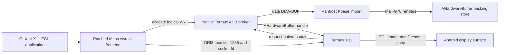

# Rootless AHardwareBuffer presentation

This directory contains the native Android half of an experimental display
path for Panfork applications running inside a glibc PRoot container. It keeps
the existing Kbase rendering route, but allocates X11 display targets as
Android `AHardwareBuffer` objects so Termux:X11 can recognize and GPU-blit the
source instead of treating it as an unknown raw DMA-BUF.

This is an opt-in research path. It requires no root access, kernel changes,
vendor EGL libraries, or Android application rebuild for the Linux client.

## Architecture



`AHardwareBuffer` pointers and gralloc handles cannot be passed directly from
glibc Mesa to Android. The Bionic broker owns each object, returns its data
DMA-BUF to Mesa for Kbase import, and sends the complete native handle to
Termux:X11 only when its existing `AHARDWAREBUFFER_SOCKET_FD` DRI3 modifier
requests it.

The broker pools up to 16 backing objects. Mesa resource destruction returns
an object to that pool; compatible later allocations reuse the gralloc object
while receiving a new protocol id. An abruptly killed client cannot send the
release message, so restart the broker if all slots become stranded.

## Components

| File | Runs in | Purpose |
| --- | --- | --- |
| `ahb-probe.c` | Termux/Bionic | Verify allocation, CPU mapping, DMA-BUF identity, and Unix-socket handle transfer |
| `tensor-ahb-service.c` | Termux/Bionic | Own, pool, export, present, and release `AHardwareBuffer` objects |
| `../../src/gallium/drivers/panfrost/tensor_ahb_protocol.h` | Both ABIs | Versioned 40-byte broker protocol and private DRI3 modifier |
| `patches/termux-x11-logical-ahb-size.patch` | Termux:X11 | Preserve the logical X pixmap height when the backing AHB has hidden padding rows |
| `patches/termux-x11-xkbcomp-include.patch` | Termux:X11 build | Avoid the vendored X11 header shadowing libc headers in the tested native build |

Termux:X11 already implements private modifier `1255` and receives an
`AHardwareBuffer` through the supplied socket. The first patch is still needed
because Panfrost requires eight hidden allocation rows: exposing the physical
height as the X pixmap height produces a visible strip at the bottom.

## Build and run in Termux

From the repository root:

```sh
clang --target=aarch64-linux-android28 -std=c11 -O2 -Wall -Wextra \
  tensor-g1/ahardwarebuffer/ahb-probe.c \
  -landroid -ldl -o ahb-probe

clang --target=aarch64-linux-android28 -std=c11 -O2 -Wall -Wextra \
  -Isrc/gallium/drivers/panfrost \
  tensor-g1/ahardwarebuffer/tensor-ahb-service.c \
  -landroid -ldl -pthread -o tensor-ahb-service

./ahb-probe
nohup ./tensor-ahb-service "$PREFIX/tmp/tensor-ahb.sock" \
  >tensor-ahb-service.log 2>&1 </dev/null &
```

Apply the Termux:X11 fixes to a checkout matching the tested July 2026
`nightly` revision before rebuilding its APK:

```sh
git -C /path/to/termux-x11 apply \
  /path/to/tensor-g1-proot-gpu/tensor-g1/ahardwarebuffer/patches/termux-x11-logical-ahb-size.patch
git -C /path/to/termux-x11 apply \
  /path/to/tensor-g1-proot-gpu/tensor-g1/ahardwarebuffer/patches/termux-x11-xkbcomp-include.patch
```

## Enable in Jammy

The AHB allocator is layered on the existing X11 DRI3 route:

```sh
export DISPLAY=:0
export PAN_MALI_X11_DRI3=1
export PAN_MALI_X11_AHB=1
tensor-g1/panfork/run-panfrost-x11 glxgears
```

Useful diagnostics:

| Variable | Default | Meaning |
| --- | --- | --- |
| `PAN_MALI_X11_AHB` | `0` | Request AHB-backed four-byte linear X11 display targets |
| `TENSOR_AHB_SOCKET` | `$PREFIX/tmp/tensor-ahb.sock` | Broker socket path shared with PRoot |
| `PAN_MALI_X11_AHB_DEBUG` | `0` | Log successful Mesa-side AHB allocations |
| `PAN_MALI_X11_DRI3_TRACE` | `0` | Log Present, Complete, and Idle events; expensive at video frame rates |

If the broker is absent, full, or rejects an allocation, Mesa deliberately
falls back to its ordinary system-DMA-heap display target. Confirm the active
path from `tensor-ahb: Mesa allocation` in the application log and
`tensor-ahb: allocated` or `recycled` in the broker log.

## Verified status

- The Pixel 6a Termux app can allocate, map, transfer, and import these objects
  without root.
- Panfrost imports the data DMA-BUF through `/dev/mali0` and renders directly
  into it.
- Termux:X11 accepts the brokered native handle through modifier `1255`.
- The logical-height Termux:X11 patch hides the eight physical padding rows.
- A six-second, approximately 60 FPS glxgears capture and a clean X-server
  restart showed moving red, green, and blue gears without the old wrong-color
  sectors. The color fix itself is the Valhall varying-stride correction, not
  an AHB synchronization side effect.

## Firefox diagnostic comparison

The same YouTube H.264 stream was measured in two 20-second windows under
GNOME Shell, `PAN_MESA_DEBUG=sync`, and DRI3 tracing. YouTube had adaptively
fallen to AVC itag 134 (360p), so these figures are diagnostic rather than a
general benchmark:

| Firefox display target | Presents/s | YouTube dropped frames | Firefox CPU | GNOME CPU | Termux:X11 CPU |
| --- | ---: | ---: | ---: | ---: | ---: |
| Ordinary system DMA heap | 3.8 | 1,238 / 1,403 (88.2%) | 50.4% | 13.7% | 13.4% |
| AHardwareBuffer | 17.4 | 1,485 / 2,994 (49.6%) | 50.9% | 30.3% | 20.9% |

AHB increased the observed Present rate by about 4.6 times, but playback was
still far from native Android smoothness. The increased compositor CPU reflects
that substantially more frames reached it; it is not evidence of a cheaper
whole desktop frame.

## Current limitations

- Mutter crashes with `SIGBUS` when its own display targets use this AHB route,
  matching the separate imported-BO CPU-map/readback failure. Keep GNOME on its
  conservative presenter and opt only Firefox or a test application into AHB.
- Firefox under GNOME remains bounded by Mutter plus Termux:X11 composition.
  A direct-X AHB measurement was started but deliberately deferred before a
  result was recorded.
- AHB improves final-window presentation only. The current MediaCodec VA path
  still performs one CPU copy from Codec2's readable NV12 output into the
  registered DMA-heap VA surface.
- The async Job Manager path can still emit Kbase atom event `0x58`; use
  `PAN_MESA_DEBUG=sync` for correctness measurements.
- There is no explicit Android fence carried from the broker into Kbase or
  from MediaCodec into Firefox. The tested paths rely on current implicit
  synchronization and DMA-BUF CPU access epochs.
