# Vendor graphics runtime packaging plan

Status: design checkpoint, 2026-08-13

## User-facing result

Hardware graphics remains an optional per-Linux-system profile. The default
software path must continue to boot when the vendor bridge is absent,
unsupported, damaged, or explicitly disabled.

uDroid users install or update one graphics component from the Linux system
page and select a renderer. Termux users receive the same component through a
small `udroid-gpu` utility. Neither path replaces the distribution's Mesa
packages or copies Android vendor libraries.

```mermaid
flowchart LR
    UI["uDroid setting or udroid-gpu CLI"] --> PROFILE["Per-rootfs graphics profile"]
    PROFILE --> RUNTIME["Versioned graphics runtime bind"]
    RUNTIME --> MESA["Mesa EGL, GLES, GLX and Zink"]
    MESA --> BRIDGE["sysvk and libhybris"]
    BRIDGE --> HAL["Device-owned Android Vulkan HAL"]
    HAL --> WSI["Ginkage AHardwareBuffer WSI"]
    WSI --> X11["Compatible Termux:X11 or embedded Lorie"]
```



## Component boundary

The release contains three independently identifiable layers:

1. `guest-mesa`: relocatable glibc Mesa libraries with EGL, GLES 1/2/3, GLX,
   Kopper and Zink. This includes the KHR/EXT vertex-divisor compatibility
   patch.
2. `vendor-bridge`: sysvk, the patched libhybris linker, required compatibility
   libraries, and a relocatable Vulkan ICD manifest.
3. `x11-wsi`: Ginkage with the AHardwareBuffer transport, its layer manifest,
   and the stable DMA-BUF/SHM fallback modes.

Android's `/vendor`, `/odm`, `/product`, `/system_ext`, `/system` and `/apex`
trees remain device-owned inputs. The package must never redistribute, cache,
or modify a phone's proprietary Vulkan HAL.

The embedded uDroid Lorie server already accepts the private
AHardwareBuffer-over-Unix-socket DRI3 modifier. Standalone Termux users need a
Termux:X11 build with the same capability. The runtime utility must check the
server rather than assuming that any process listening on `DISPLAY` supports
it.

## Release layout

Each architecture is a separate archive. The first supported target is
`linux-aarch64-glibc`; other ABIs are not inferred from the Android ABI alone.

```text
udroid-graphics-<version>-linux-aarch64-glibc/
├── manifest.json
├── sources.json
├── THIRD_PARTY_NOTICES.md
├── bin/
│   ├── udroid-gpu-run
│   ├── udroid-gpu-probe
│   └── udroid-gpu-report
├── lib/
│   ├── mesa/
│   │   ├── libEGL.so.1
│   │   ├── libGL.so.1
│   │   ├── libGLESv1_CM.so.1
│   │   ├── libGLESv2.so.2
│   │   ├── libglapi.so.0
│   │   └── dri/zink_dri.so
│   └── bridge/
│       ├── libsysvk.so
│       ├── libhardware.so.2
│       ├── libhybris-common.so.1
│       ├── linker/
│       └── bionic/
├── libexec/
│   ├── egl-gles3-instancing
│   ├── vulkan-core-features
│   └── x11-ahb-present-probe
└── share/vulkan/
    ├── icd.d/sysvk.json
    └── explicit_layer.d/
        ├── VkLayer_window_system_integration.json
        └── libVkLayer_window_system_integration.so
```

All manifests use paths relative to their JSON location. All packaged ELF
RUNPATH entries use `$ORIGIN`; an absolute build path fails CI. Debug symbols
are split into a separate archive. Source and build trees are never included
in the runtime archive.

`manifest.json` records:

- component and schema versions;
- architecture, glibc floor and minimum Android API;
- Mesa, sysvk, libhybris and WSI source revisions;
- patch identities and complete file SHA-256 values;
- supported renderer and WSI profile identifiers;
- required guest `DT_NEEDED` libraries;
- compatible X11 AHardwareBuffer protocol revision;
- known missing Vulkan features and validation status.

## Runtime mounting

The runtime is installed outside every rootfs and bound at a stable guest
path:

```text
/opt/udroid/graphics
```

uDroid stores concrete versions below
`filesDir/components/graphics/<version>/<abi>`. Termux stores them below
`$PREFIX/opt/udroid-gpu/<version>`. A launch binds the selected concrete
directory; it does not depend on a mutable `current` symlink.

PRoot cannot enforce a truly read-only bind against another process with the
same Android UID. Therefore both integrations verify the manifest before
launch and atomically restore a changed component. Guest package operations
cannot install over the distribution's `/usr` because the graphics runtime is
kept under `/opt/udroid/graphics`.

The launch adds only existing Android paths required by the selected profile:

```text
/system
/system_ext
/vendor
/odm
/product
/apex
/dev
/proc
/sys
/linkerconfig/ld.config.txt
```

## Graphics profiles

Rendering, WSI, media decoding and desktop composition remain separate axes.

| Renderer | Behavior |
| --- | --- |
| `system` | Distribution Mesa, unchanged |
| `vendor-vulkan` | Packaged Zink to the Android vendor Vulkan HAL |
| `software` | Explicit distribution software renderer |
| `panfork` | Reserved independent experimental profile |
| `auto` | Selects only a capability-approved backend and records its reason |

| Vendor WSI | Behavior |
| --- | --- |
| `ginkage-ahb` | Preferred AHardwareBuffer transport |
| `ginkage-dmabuf-copy` | Stable copy fallback |
| `ginkage-dmabuf-zero` | Experimental direct DMA-BUF presentation |
| `shm` | Compatibility fallback |

An explicitly selected backend is fail-closed. It must never silently become
Panfork or llvmpipe. `auto` may fall back, but must record the selected route
and reason in the supervisor journal or CLI report.

## uDroid integration

Add a dedicated `feat/graphics-runtime` branch from app `main`; do not couple
it to the FMA feature branch. Reuse the media/audio component lifecycle
patterns, not their setting or transport implementation.

Required app pieces:

- `GraphicsConfigurationStore`: renderer and WSI selection per rootfs.
- `GraphicsRuntimeInstaller`: verified, versioned staging and atomic activation.
- `GraphicsCapabilityProbe`: app-domain HAL visibility, ELF dependency, Vulkan,
  EGL/GLES and X11 AHardwareBuffer gates.
- `GraphicsEndpoint`: concrete host component directory and guest bind path.
- `GraphicsEnvironment`: one resolved environment contract shared by terminal,
  direct application and desktop launches.
- supervisor journal fields for requested profile, resolved renderer, GPU,
  WSI, component revision, startup time and failure reason.

The Linux system page should show one compact Graphics panel:

- `System`, `Automatic`, and `Vendor Vulkan (experimental)` renderer choices;
- advanced WSI choices behind a disclosure row;
- detected GPU and current GLES/Vulkan identity;
- install/update/remove component action;
- a copyable diagnostic report;
- a restart-required message when the active system owns a session.

Enabling graphics does not globally alter the rootfs. The supervisor adds the
component bind and resolved environment to terminal, desktop and Linux app
launches for that rootfs. Desktop compositing keeps its existing independent
toggle.

## Termux utility

The initial utility is a shell frontend backed by machine-readable JSON from
the packaged probes. It lives in `$PREFIX/bin/udroid-gpu` and supports:

```text
udroid-gpu install [VERSION]
udroid-gpu update
udroid-gpu list
udroid-gpu doctor [--json]
udroid-gpu run --profile vendor-vulkan -- COMMAND...
udroid-gpu proot-login DISTRO [--profile PROFILE]
udroid-gpu desktop DISTRO -- COMMAND...
udroid-gpu report [--json]
udroid-gpu remove VERSION
```

`proot-login` constructs `proot-distro login` with `--shared-tmp`, the exact
component bind and only the required existing Android binds. `run` is usable
inside uDroid CLI rootfses and custom PRoot launchers. The tool never edits
`.bashrc`, `/etc/environment`, Mesa alternatives, or Vulkan configuration
globally.

Display lifecycle stays opt-in. A future `udroid-gpu x11 start` may supervise
only a Termux:X11 process whose PID and start token it owns; it must never kill
an arbitrary process already using the display.

## Initial support matrix

The first published archive should be deliberately narrow:

- Android API 26 or newer;
- AArch64 Android device and AArch64 guest;
- glibc distributions at or above the build floor;
- Debian/Ubuntu first, followed by Arch/Fedora after dependency probes pass;
- compatible embedded Lorie or Termux:X11;
- vendor Vulkan devices which pass the full probe ladder.

Alpine/musl, 32-bit guests, x86 guests and protected media are unsupported by
this component. A detected Mali name is evidence, not a hard-coded product
gate; other vendor HALs may be admitted only after the same probes pass.

## Build and release gates

1. Build every component from pinned source in a clean AArch64 glibc container.
2. Install to the final `/opt/udroid/graphics` prefix during linking; do not
   repair absolute paths after release.
3. Strip runtime binaries and publish split debug symbols.
4. Reject unexpected files, unresolved `DT_NEEDED` entries, absolute RUNPATHs,
   host paths, mixed source revisions and unlisted hashes.
5. Test archive extraction, manifest tampering, atomic update and rollback.
6. Run the Vulkan identity and core-feature probes.
7. Run automatic EGL ES3 creation and instanced pixel readback.
8. Run the AHardwareBuffer Present lifecycle and surface detach/reattach gates.
9. Run a bounded compositor and SuperTuxKart smoke test without overrides or
   preload diagnostics.
10. Publish the archive, manifest, checksums, source lock, notices and SBOM.

The initial transport archive is `.tar.xz`, matching uDroid's bundled
streaming extractor. Compression format is part of the release-index contract;
clients must not guess it from the target ABI.

The current phone binaries cannot be released directly: they include absolute
`/root/hybris-rootless` paths, debug data and guest-specific dependencies. The
next implementation checkpoint is a relocatable build which reproduces the
already-passing Vulkan, GLES 3.1 and instanced-draw probes from the final
archive layout.
