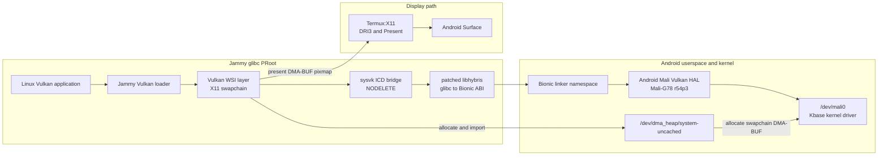

# Milestone: rootless glibc Vulkan through libhybris

On 2026-07-17 a Pixel 6a with Tensor G1 successfully ran glibc Vulkan
applications inside a Jammy uDroid/PRoot, rendered on the phone's proprietary
Mali-G78 Vulkan driver, and presented them in Termux:X11 through DMA-BUF and
DRI3. No root access, custom kernel, `/dev/dri` access, VirGL, or ANGLE is used.

This path is separate from both the repository's open-source Panfork OpenGL
driver and its native Bionic Vulkan wrapper.

## Architecture



The Vulkan commands travel through sysvk and libhybris to the vendor HAL. The
WSI layer owns presentation: it allocates an external image from the Android
DMA heap, imports it into Vulkan, then gives the same DMA-BUF to Termux:X11 as
a DRI3 pixmap.

## Verified hardware and software

| Component | Verified value |
| --- | --- |
| Phone | Google Pixel 6a, `bluejay` |
| SoC and GPU | Tensor G1, Mali-G78 |
| Android userspace | API 37 test build |
| Linux guest | Ubuntu Jammy glibc PRoot through uDroid |
| X server | Termux:X11 on display `:0` |
| Vendor Vulkan | Mali r54p3, Vulkan 1.4.305 reported by the native path |
| Rootless device access | `/dev/mali0`, `/dev/dma_heap/system`, `/dev/dma_heap/system-uncached` |
| Inaccessible and unnecessary | `/dev/dri` |

Pinned source revisions used by the working device snapshot:

| Component | Repository | Revision |
| --- | --- | --- |
| sysvk | `xMeM/sysvk` | `23ecd775ed6fe06bb5ac0063b5f981f70c543c67` |
| libhybris | `libhybris/libhybris` | `7079712a42ea2754adf747e70c6cc75764c8596e` |
| Vulkan WSI layer | `ginkage/vulkan-wsi-layer` | `e2e9eaac5494f26d16928471e190057fb6eb18fb` |
| Vulkan-Headers | `KhronosGroup/Vulkan-Headers` | `e3b1eec08173d6b825cd3ac88c885a63b621504a` |

## Required dirty fixes

This milestone deliberately preserves the prototype's non-upstream fixes.

1. Apply
   [`libhybris-0001-optional-raw-pthread-exit.patch`](patches/libhybris-0001-optional-raw-pthread-exit.patch)
   and launch with `HYBRIS_PTHREAD_RAW_EXIT=1`. Some vendor-created threads
   corrupt glibc-private TLS when returning normally and crash inside
   `__libc_thread_freeres`. The raw Linux thread exit skips that incompatible
   cleanup.
2. Link sysvk with `-Wl,-z,nodelete`. The vendor stack registers process-exit
   callbacks which otherwise survive after the ICD is unloaded and jump into
   unmapped code. The verified ELF has the `NODELETE` dynamic flag.
3. Apply
   [`vulkan-wsi-layer-0001-link-x11-external-memory.patch`](patches/vulkan-wsi-layer-0001-link-x11-external-memory.patch)
   so the X11 WSI target contains its external-memory implementation.
4. Apply
   [`vulkan-wsi-layer-0002-open-android-dma-heap-read-only.patch`](patches/vulkan-wsi-layer-0002-open-android-dma-heap-read-only.patch).
   Android exposes the public heap character devices read-only to the app, but
   permits allocation through `DMA_HEAP_IOCTL_ALLOC`. Opening the heap
   `O_RDONLY` unlocks DRI3 without root.
5. Install
   [`VkLayer_window_system_integration.jammy.json`](VkLayer_window_system_integration.jammy.json)
   instead of the upstream generated manifest. Jammy's Vulkan loader 1.3.204
   rejects newer surface-maintenance extensions advertised by the current
   generated file. This intentionally minimal manifest exposes only the
   extensions needed by this experiment.

The raw pthread exit is the ugliest fix in this set. It can bypass glibc TLS
destructors and leak per-thread resources. Keep it opt-in and limited to this
vendor-driver process.

## Reproducing the component builds

The working guest keeps its experiment under `/root/hybris-rootless`. Android
system and vendor libraries are bind-mounted or copied from the same phone;
they are not redistributed by this repository.

libhybris was configured with:

```sh
./configure \
  --prefix=/root/hybris-rootless/upstream-prefix \
  --libdir=/root/hybris-rootless/upstream-prefix/lib \
  --with-android-headers=/root/hybris-rootless/prefix/include/android \
  --with-default-hybris-ld-library-path=/system/lib64:/system_ext/lib64:/product/lib64:/vendor/lib64:/vendor/lib64/egl:/vendor/lib64/hw:/odm/lib64:/apex/com.android.runtime/lib64/bionic \
  --enable-arch=arm64 \
  --enable-mali-quirks \
  --enable-property-cache \
  --enable-experimental \
  --enable-debug \
  CFLAGS='-O2 -g -Wa,--noexecstack' \
  CXXFLAGS='-O2 -g -Wa,--noexecstack' \
  LDFLAGS='-Wl,-z,noexecstack'
make -j4
```

The sysvk ICD was linked against the resulting libhybris hardware bridge:

```sh
gcc -shared -fPIC /root/hybris-rootless/src/sysvk/sysvk.c \
  -o /root/hybris-rootless/src/sysvk/libsysvk-upstream-nodelete.so \
  -I/root/hybris-rootless/src/sysvk/include \
  -L/root/hybris-rootless/src/libhybris-upstream/hybris/hardware/.libs \
  -Wl,-rpath-link,/root/hybris-rootless/src/libhybris-upstream/hybris/common/.libs \
  -Wl,-z,nodelete \
  -lhardware
```

Copy [`sysvk-nodelete-icd.json`](sysvk-nodelete-icd.json) beside the resulting
library as `sysvk_upstream_nodelete_icd.json`. The launcher selects this ICD
explicitly, so it does not replace the guest's normal Vulkan configuration.

The WSI layer was configured as an X11-only Release build using the Android DMA
heap allocator:

```sh
cmake -S /root/hybris-rootless/src/vulkan-wsi-layer \
  -B /root/hybris-rootless/build-wsi-x11 \
  -G Ninja \
  -DCMAKE_BUILD_TYPE=Release \
  -DCMAKE_INSTALL_PREFIX=/root/hybris-rootless/wsi-prefix \
  -DVULKAN_CXX_INCLUDE=/root/hybris-rootless/src/Vulkan-Headers/include \
  -DBUILD_WSI_HEADLESS=1 \
  -DBUILD_WSI_WAYLAND=0 \
  -DBUILD_WSI_DISPLAY=0 \
  -DBUILD_WSI_X11=1 \
  -DSELECT_EXTERNAL_ALLOCATOR=dma_buf_heaps \
  -DWSIALLOC_MEMORY_HEAP_NAME=system-uncached
cmake --build /root/hybris-rootless/build-wsi-x11 -j4
cmake --install /root/hybris-rootless/build-wsi-x11
```

Install the WSI shared object and the Jammy manifest under
`/usr/share/vulkan/implicit_layer.d/`, then install `tensor-vulkan-run` as
`/usr/local/bin/tensor-vulkan-run`.

## Running applications

The launcher encodes the working library paths, ICD, libhybris workaround, and
WSI defaults:

```sh
tensor-vulkan-run vulkaninfo --summary
tensor-vulkan-run vkcube
tensor-vulkan-run vkcube --present_mode 0
```

The installed Ginkage path remains the default. Backend selection is explicit
and affects only the launched process tree:

```sh
# Stable baseline
TENSOR_VK_BACKEND=ginkage TENSOR_VK_WSI_MODE=copy tensor-vulkan-run vkcube

# Isolated AHardwareBuffer oracle after running build-xmem-ahb-oracle.sh
TENSOR_VK_BACKEND=xmem-ahb TENSOR_VK_WSI_MODE=ahb tensor-vulkan-run vkcube
```

`xmem-ahb` uses a uniquely named explicit Vulkan layer and disables the
installed Ginkage implicit layer for that process. It stops with an unavailable
error if the isolated layer, manifest, or AHB wrapper is missing; it never
silently falls back to Ginkage or software rendering. Set `TENSOR_VK_TRACE=1`
to print the resolved renderer, WSI, and layer directory before launch.

Build the xMeM oracle only from the pinned source revision using:

```sh
./build-xmem-ahb-oracle.sh
```

The script installs the AHB wrapper and xMeM WSI into separate prefixes under
`/root/hybris-rootless`. It does not replace the system WSI manifest. Run the
standalone `ahb-probe` first; promote to `vkcube` only when every allocation,
socket transfer, receiver-lifetime, stride, fence, and hash case passes.

The default `TENSOR_VK_WSI_MODE=copy` uses a DRI3 DMA-BUF pixmap followed by a
Termux:X11 server-side GPU copy. It was the fastest and most consistent mode in
the initial Tensor G1 measurements. The alternatives are:

```sh
TENSOR_VK_WSI_MODE=zero tensor-vulkan-run vkcube
TENSOR_VK_WSI_MODE=shm tensor-vulkan-run vkcube
TENSOR_VK_ALLOW_NON_FIFO=0 tensor-vulkan-run vkcube
```

- `copy`: practical default; DMA-BUF transport with a server-side GPU blit.
- `zero`: no server blit, but Termux:X11 Present idle-event pacing can stall.
- `shm`: compatibility escape hatch; performs a full GPU-to-CPU-to-X copy.
- `TENSOR_VK_ALLOW_NON_FIFO=1`: advertises immediate and mailbox modes. The
  application must still select one, usually by disabling VSync.

## Verified results

The following passed through the Jammy glibc path:

- `vulkaninfo --summary`, reporting the Mali-G78.
- Compute dispatch with buffer readback and exact-result validation.
- Offscreen graphics draw with pixel readback and exact-result validation.
- Visible XCB presentation in Termux:X11.
- A 1,800-frame, 1920x1080 immediate-present `vkcube` soak in 15.29 seconds,
  return code 0, with no Mali, Kbase, MMU, hang, or reset message in the
  captured kernel log window.
- `strace` confirmation that DRI3 opens
  `/dev/dma_heap/system-uncached` and does not call `shmget` or `shmat`.

Pixel 6a, 1920x1080 `vkcube`, 600 immediate-present frames:

| Presentation path | Wall time | Application user CPU |
| --- | ---: | ---: |
| DRI3 GPU-copy | 4.54-6.50 s | 0.24-0.30 s |
| DRI3 zero-copy | 6.61-7.60 s | 0.39-0.44 s |
| MIT-SHM CPU-copy | 12.28-13.15 s | 13.32-15.26 s |

Android fixed-performance mode produced 3.89 seconds for DRI3 GPU-copy in one
development-mode run. It was restored to off and is not a launcher default
because it increases thermal load and is intended for repeatable benchmarks.

These numbers measure the presentation path, not general GPU performance. Real
applications remain affected by shader cost, PRoot syscall translation,
resolution, synchronization, and Tensor G1 thermal throttling.

## Known limitations

- This is a research bridge over proprietary, device-matched Android blobs;
  it is not PanVK and is not portable to arbitrary Mali devices.
- The libhybris pthread workaround intentionally skips incompatible glibc
  cleanup and needs longer leak and shutdown testing.
- The WSI manifest is pinned down for Jammy's older loader rather than exposing
  every extension supported by the current WSI layer.
- DRI3 zero-copy is not automatically fastest in a nested Android X server.
  Buffer-release behavior matters more than the absence of a blit.
- Swap control, broad Vulkan CTS coverage, Wine/Proton, and real Vulkan games
  remain unverified.
- The open-source Panfork OpenGL route now has its own DMA-heap/Kbase/DRI3
  presenter. It is independent of this Vulkan WSI layer.

## Follow-on OpenGL milestone (completed 2026-07-17)

The same rootless primitives were reused by Panfork: linear display targets
are allocated from `/dev/dma_heap/system`, imported into Kbase through
`BASE_MEM_IMPORT_TYPE_UMM`, exported at swap, and presented to Termux:X11 as
DRI3 1.2 pixmaps. This removes Panfork's per-frame framebuffer readback and
MIT-SHM upload without root. Termux:X11 still chooses a server-side copy for
the reliable mode; strict no-copy Present is accepted but remains invisible
under the tested GNOME/Mutter session.

## References

- [Android libdmabufheap `BufferAllocator.cpp`](https://android.googlesource.com/platform/system/memory/libdmabufheap/+/refs/tags/android-cts-17.0_r1/BufferAllocator.cpp)
  opens DMA heap devices with `O_RDONLY | O_CLOEXEC` before issuing the
  allocation ioctl.
- [Linux/Android DMA heap UAPI](https://android.googlesource.com/kernel/common/+/refs/heads/android-mainline/include/uapi/linux/dma-heap.h)
  defines `DMA_HEAP_IOCTL_ALLOC` and the returned DMA-BUF flags.
- [Termux:X11](https://github.com/termux/termux-x11) provides the rootless X
  server used by this experiment.
- [Vulkan WSI layer](https://github.com/ginkage/vulkan-wsi-layer),
  [sysvk](https://github.com/xMeM/sysvk), and
  [libhybris](https://github.com/libhybris/libhybris) are the three bridge
  components pinned above.
