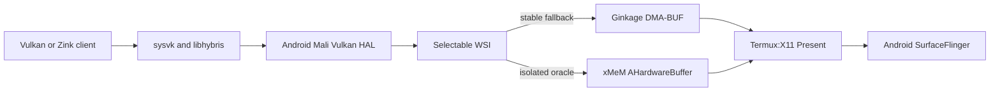

# xMeM AHB and accelerated KDE checkpoint

Date: 2026-08-12

Device: Pixel 6a, Tensor G1, Mali-G78

Status: diagnostic checkpoint; not production-ready

## Goal

Retain Ginkage as the working vendor-Vulkan X11 foundation while evaluating
xMeM's AHardwareBuffer allocation and Termux:X11 transport. The immediate
desktop test was an accelerated X11 Plasma/KWin session without Panfrost.



The runner keeps these choices process-local:

```sh
TENSOR_VK_BACKEND=ginkage TENSOR_VK_WSI_MODE=copy tensor-vulkan-run vkcube
TENSOR_VK_BACKEND=xmem-ahb TENSOR_VK_WSI_MODE=ahb tensor-vulkan-run vkcube
```

An explicitly selected backend stops when its files are unavailable. It does
not silently become Panfrost, llvmpipe, or another WSI.

## Preserved implementation

- `ahb-probe/` allocates, maps, hashes, transports, releases, and reimports
  AHardwareBuffers over an `AF_UNIX` socket. Widths cover both sides of common
  stride boundaries. JSONL output separates allocation, write, send, receive,
  read, and total cost; `plot-results.py` renders the latency graph.
- `build-xmem-ahb-oracle.sh` requires xMeM revision
  `d5624d42d8b2debbd910ad25662a05c751eb38b7`, applies the wrapper integration
  patch, and installs into isolated prefixes.
- `tensor-vulkan-run` leaves Ginkage as the default and exposes xMeM only as
  the explicit `xmem-ahb` oracle.
- `patches/termux-x11-0001-probe-ahb-external-textures.patch` preserves the
  server-side investigation against Termux:X11 `0cb0203c283bfafbad380b90444296aa42af058d`.

The Termux:X11 patch adds four diagnostic changes:

1. a rootless DRI3 capability-token open callback using `/dev/null`;
2. DMA-BUF `DMA_BUF_IOCTL_SYNC` start/end around CPU access;
3. sampled hashes when Present reads imported pixmaps;
4. direct AHardwareBuffer sampling with `GL_TEXTURE_EXTERNAL_OES`, retaining
   the ordinary `GL_TEXTURE_2D` path as fallback.

It also makes uDroid's optional JNI view registration safe when building the
standalone Termux:X11 APK.

## Verification completed

- Host mock lifecycle test: **18/18 passed**.
- Shell syntax and patch whitespace checks passed.
- The vendor Vulkan route presented visible changing output; the purple cube
  was observed, though screenshot timing sometimes captured it after it had
  disappeared.
- Accelerated KWin/Plasma launched without Panfrost or llvmpipe being the
  intended rendering route.

The host mock result validates probe logic only. It does not validate Android
allocation cost, fences, Termux:X11 registration, or GPU Present offload.

## Failed hypotheses and visual observations

- Detaching the producer after handle transfer did not solve corruption:
  **2/8 clean captures, 6.81% mean corruption**.
- Sampling imported AHardwareBuffers as `GL_TEXTURE_EXTERNAL_OES`, matching
  Android `GLConsumer`, did not clear the artifact gate.
- The large glxgears gear appeared bluish rather than reddish in one run.
  Color alone is not a synchronization proof, but the change rejects the run
  as a visual-correctness baseline.
- Window movement remained poor.
- Plasma panel hover feedback took about one second, the application launcher
  took roughly two to three seconds to appear, and menu navigation lagged.

Therefore neither producer lifetime, a missing DMA-BUF CPU cache transition,
nor the 2D-versus-external texture target is sufficient by itself.

## What the KDE result means

The `/dev/null` DRI3 callback is only a discovery token. It cannot provide the
normal Linux DRM/GBM contract that KWin expects: device identity, buffer
allocation, modifiers, explicit synchronization, timeline/presentation
feedback, or a compositor clock. The successful Mali renderer identity proves
GPU execution, not efficient desktop presentation.

The remaining candidates must be isolated with micro-probes:

1. PresentComplete and PresentIdle ordering, including serial-to-buffer reuse.
2. Acquire/release fence propagation across Vulkan, X11, GLES, and Android.
3. Buffer age and damage correctness during tooltip and panel animation.
4. KWin frame scheduling versus Termux:X11/SurfaceFlinger cadence.
5. Scene-composite copy count and CPU time per panel interaction.
6. Stable color/channel interpretation for every AHB format and shader path.

Do not tune Plasma settings or repeatedly launch a desktop until a smaller
panel-like damage/tooltip probe identifies the first boundary that stalls.

## Promotion gate

Keep Ginkage DMA-BUF copy as the fallback. Do not enable xMeM AHB or the
Termux:X11 external-texture patch by default until all of these pass:

- deterministic changing-pixel and buffer-reuse tests;
- correct Present completion/idle ordering and clean shutdown;
- resize, orientation, and server-restart lifecycle;
- real Termux:X11 GPU-offload counters;
- no color, stale-frame, or geometry artifacts;
- lower total CPU and better P95/P99 frame time than Ginkage copy;
- responsive bounded menu/tooltip animation before full Plasma testing.
