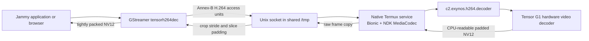

# Rootless Android MediaCodec bridge

This directory contains an experimental bridge from ARM64 Linux applications
inside a uDroid/PRoot container to Android's native MediaCodec service. It does
not use a V4L2 device, VA-API driver, copied vendor library, root permission, or
kernel change.

The tested H.264 path runs the Codec2 Exynos decoder from a native Bionic
process in Termux. A GStreamer element in Jammy sends compressed access units
over the `/tmp` directory shared by uDroid and Termux, then receives
CPU-readable NV12 frames.

> [!WARNING]
> This is a proof-of-function prototype. Decoded frames are copied out of
> MediaCodec, through a Unix socket, and again into tightly packed GStreamer
> buffers. The protocol is local, host-endian, H.264-only, and not hardened for
> untrusted clients.

## Architecture



The service explicitly starts an NDK Binder thread pool. A standalone Termux
executable does not receive the Binder process setup normally created for an
Android application. Termux lacks the platform-only
`android/binder_process.h` header and a linker stub for `libbinder_ndk.so`, so
the two public Binder process functions are resolved from Android's system
library using `dlopen` and `dlsym`.

## Components

| File | Runs in | Purpose |
| --- | --- | --- |
| `mediacodec-probe.c` | Termux/Bionic | Configure/start/stop codec discovery |
| `mediacodec-decode.c` | Termux/Bionic | Standalone Annex-B decode smoke |
| `mediacodec-service.c` | Termux/Bionic | Persistent single-client-at-a-time socket service |
| `bridge-protocol.h` | Both ABIs | Versioned 40-byte local message header |
| `bridge-client.c` | Jammy/glibc | End-to-end bridge validation client |
| `gsttensorh264dec.c` | Jammy/glibc | GStreamer `GstVideoDecoder` element |

## Build the native Android side

Run these commands in Termux from the repository checkout:

```sh
clang --target=aarch64-linux-android28 -std=c11 -O2 -Wall -Wextra \
  tensor-g1/media-codec/mediacodec-probe.c \
  -lmediandk -o mediacodec-probe

clang --target=aarch64-linux-android28 -std=c11 -O2 -Wall -Wextra \
  tensor-g1/media-codec/mediacodec-decode.c \
  -lmediandk -ldl -o mediacodec-decode

clang --target=aarch64-linux-android28 -std=c11 -O2 -Wall -Wextra \
  -Itensor-g1/media-codec \
  tensor-g1/media-codec/mediacodec-service.c \
  -lmediandk -ldl -o mediacodec-service
```

Basic discovery and standalone decode:

```sh
./mediacodec-probe
./mediacodec-decode sample-annex-b.h264 \
  c2.exynos.h264.decoder 1920 1080 60
```

The standalone decoder extracts SPS/PPS into MediaCodec CSD buffers by
default. Set `TENSOR_MEDIACODEC_INBAND_CSD=1` to verify a stream that repeats
SPS/PPS in-band.

## Build the Jammy side

The plugin was tested with GStreamer 1.20 on Ubuntu 22.04:

```sh
apt-get install libgstreamer1.0-dev \
  libgstreamer-plugins-base1.0-dev gstreamer1.0-tools \
  gstreamer1.0-plugins-base gstreamer1.0-plugins-good
```

Review the simulated package transaction before accepting it on an old PRoot:

```sh
apt-get -s install libgstreamer1.0-dev \
  libgstreamer-plugins-base1.0-dev gstreamer1.0-tools
```

The tested Jammy image initially had old systemd libraries beside a newer
`libudev1`; apt proposed removing GNOME to resolve that mismatch. Align the
systemd/udev package versions first if the simulation lists desktop removals.

Build the validation client and plugin inside Jammy:

```sh
cc -std=c11 -O2 -Wall -Wextra -Itensor-g1/media-codec \
  tensor-g1/media-codec/bridge-client.c -o bridge-client

cc -std=c11 -O2 -Wall -Wextra -fPIC -shared \
  -Itensor-g1/media-codec \
  tensor-g1/media-codec/gsttensorh264dec.c \
  -o libgsttensormediacodec.so \
  $(pkg-config --cflags --libs gstreamer-video-1.0 gstreamer-1.0)

install -m 0755 libgsttensormediacodec.so \
  "$(pkg-config --variable=pluginsdir gstreamer-1.0)/"
rm -f /root/.cache/gstreamer-1.0/registry.aarch64.bin
gst-inspect-1.0 tensorh264dec
```

## Run the bridge

uDroid binds Termux's `$PREFIX/tmp` to `/tmp` inside Jammy. Start the native
service from Termux using the Termux-side path:

```sh
nohup ./mediacodec-service \
  "$PREFIX/tmp/tensor-mediacodec.sock" \
  >mediacodec-service.log 2>&1 </dev/null &
```

Then run either smoke from Jammy:

```sh
./bridge-client /tmp/tensor-mediacodec.sock sample-annex-b.h264 \
  1920 1080 60 c2.exynos.h264.decoder

GST_DEBUG=tensorh264dec:5 gst-launch-1.0 -q \
  filesrc location=sample-annex-b.h264 ! \
  h264parse config-interval=-1 ! \
  video/x-h264,stream-format=byte-stream,alignment=au ! \
  tensorh264dec ! fakesink sync=false
```

The service accepts clients sequentially and remains available after a client
disconnects. Pass `--once` after the socket path for a one-client smoke.

Optional environment variables:

| Variable | Default | Meaning |
| --- | --- | --- |
| `TENSOR_MEDIACODEC_SOCKET` | `/tmp/tensor-mediacodec.sock` | Plugin socket path |
| `TENSOR_MEDIACODEC_COMPONENT` | `c2.exynos.h264.decoder` | Android component name |
| `TENSOR_MEDIACODEC_INBAND_CSD` | unset | Standalone decoder uses in-band SPS/PPS |

## Pixel 6a results

Codec discovery on the Tensor G1 device produced:

| Format | Selected component | Configure/start/stop |
| --- | --- | --- |
| H.264 | `c2.exynos.h264.decoder` | pass |
| HEVC | `c2.exynos.hevc.decoder` | pass |
| VP9 | `c2.exynos.vp9.decoder` | pass |
| AV1 | `c2.google.av1.decoder` | pass, software component |

The two-second 1920x1080 60 FPS H.264 stream produced these checkpoints:

- Native in-band MediaCodec smoke: 120/120 decoded frames and EOS in about
  1.10 seconds.
- Jammy bridge client: 120/120 access units and frames, 373,363,200 raw bytes,
  and EOS in 1.227 seconds, about 98 decoded/copied FPS.
- GStreamer element: 120/120 NV12 frames delivered to `fakesink`.
- MediaCodec initially reported a 1920x1088 padded slice height, then 1080.
  The plugin strips stride/slice padding before exposing 1920x1080 NV12.

These results prove rootless hardware decode and cross-ABI transport. They do
not prove sustained thermal performance, arbitrary H.264 compatibility, or a
working browser path.

## Current limitations

- H.264 byte-stream input only; access units must be aligned and carry in-band
  SPS/PPS for the service.
- One active client at a time; no protocol negotiation beyond version 1.
- Host-endian protocol intended only for local ARM64 processes.
- No flush, seek, mid-stream reconfiguration, resolution change, or recovery
  after a client disconnects mid-frame.
- Every decoded frame is copied out of MediaCodec, over the socket, and into a
  new GStreamer NV12 buffer. The 1080p60 smoke moves roughly 373 MB in two
  seconds before display/compositor copies.
- No AHardwareBuffer, DMA-BUF, GstMemory, VA-API, or zero-copy output yet.
- Firefox's VA-API path still rejects the device because there is no DRM render
  fd. GNOME Web/GStreamer is the shorter integration route, but GNOME Web 42.4
  currently segfaults in GTK style-provider setup after Panfrost surfaceless
  EGL initializes and before the test page loads.
