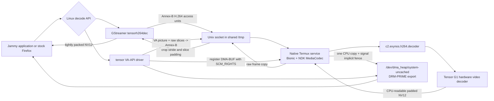
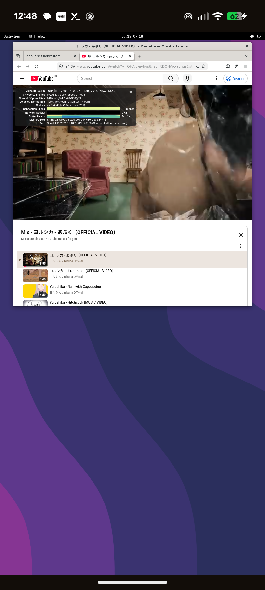

# Rootless Android MediaCodec bridge

This directory contains an experimental bridge from ARM64 Linux applications
inside a uDroid/PRoot container to Android's native MediaCodec service. It does
not use a V4L2 device, copied vendor library, root permission, kernel change,
or custom Firefox build. Both GStreamer and an experimental VA-API frontend
use the same local bridge.

The tested H.264 path runs the Codec2 Exynos decoder from a native Bionic
process in Termux. A GStreamer element in Jammy sends compressed access units
over the `/tmp` directory shared by uDroid and Termux, then receives
CPU-readable NV12 frames. The VA-API frontend additionally repackages the
picture/slice buffers emitted by FFmpeg, synthesizes the required Annex-B H.264
parameter sets, and registers exportable Android DMA-heap destinations with the
native service using `SCM_RIGHTS`.

> [!WARNING]
> This is a proof-of-function prototype. GStreamer frames are copied out of
> MediaCodec and through a Unix socket. The VA path avoids that raw-frame socket
> transfer, but still CPU-copies MediaCodec output into a registered DMA-BUF.
> The protocol is local, host-endian, H.264-only, and not hardened for untrusted
> clients.

## Architecture



The service explicitly starts an NDK Binder thread pool. A standalone Termux
executable does not receive the Binder process setup normally created for an
Android application. Termux lacks the platform-only
`android/binder_process.h` header and a linker stub for `libbinder_ndk.so`, so
the two public Binder process functions are resolved from Android's system
library using `dlopen` and `dlsym`.

## Components

| File | Runs in | Purpose |
| --- | --- | --- |
| `mediacodec-probe.c` | Termux/Bionic | Configure/start/stop codec discovery |
| `mediacodec-decode.c` | Termux/Bionic | Standalone Annex-B decode smoke |
| `mediacodec-service.c` | Termux/Bionic | Persistent single-client-at-a-time socket service |
| `release-fence.c` | Termux/Bionic | Kbase soft-event fence imported as the DMA-BUF's implicit writer fence |
| `dmabuf-release-fence-probe.c` | Termux/Bionic | Rootless Kbase/sync-file/DMA-BUF permission and signal smoke |
| `bridge-protocol.h` | Both ABIs | Versioned 40-byte local message header and shared-surface capability |
| `bridge-client.c` | Jammy/glibc | End-to-end bridge validation client |
| `surface-lifecycle-bench.c` | Jammy/glibc | Browser-free DMA-BUF register/submit/ACK ordering and latency benchmark |
| `egl-nv12-consumer.c` | Jammy/glibc | Surfaceless Panfrost R8/GR88 importer and finalized-pixel correctness probe |
| `gsttensorh264dec.c` | Jammy/glibc | GStreamer `GstVideoDecoder` element |
| `va/tensor_drv_video.c` | Jammy/glibc | H.264 VA-API frontend for FFmpeg and stock Firefox |
| `video-benchmark.html` | Jammy browser | Local playback page with one-second decoded/dropped-frame counters |

## Build the native Android side

Run these commands in Termux from the repository checkout:

```sh
clang --target=aarch64-linux-android28 -std=c11 -O2 -Wall -Wextra \
  tensor-g1/media-codec/mediacodec-probe.c \
  -lmediandk -o mediacodec-probe

clang --target=aarch64-linux-android28 -std=c11 -O2 -Wall -Wextra \
  tensor-g1/media-codec/mediacodec-decode.c \
  -lmediandk -landroid -ldl -o mediacodec-decode

clang --target=aarch64-linux-android28 -std=c11 -O2 -Wall -Wextra \
  -Iinclude -Isrc/panfrost/base/include -Itensor-g1/media-codec \
  tensor-g1/media-codec/mediacodec-service.c \
  tensor-g1/media-codec/release-fence.c \
  -lmediandk -ldl -o mediacodec-service

clang --target=aarch64-linux-android28 -std=c11 -O2 -Wall -Wextra \
  -Iinclude -Isrc/panfrost/base/include -Itensor-g1/media-codec \
  tensor-g1/media-codec/dmabuf-release-fence-probe.c \
  -o dmabuf-release-fence-probe
```

Basic discovery and standalone decode:

```sh
./mediacodec-probe
./mediacodec-decode sample-annex-b.h264 \
  c2.exynos.h264.decoder 1920 1080 60
```

The standalone decoder extracts SPS/PPS into MediaCodec CSD buffers by
default. Set `TENSOR_MEDIACODEC_INBAND_CSD=1` to verify a stream that repeats
SPS/PPS in-band.

## Build the Jammy side

The plugin was tested with GStreamer 1.20 on Ubuntu 22.04:

```sh
apt-get install libgstreamer1.0-dev \
  libgstreamer-plugins-base1.0-dev gstreamer1.0-tools \
  gstreamer1.0-plugins-base gstreamer1.0-plugins-good
```

Review the simulated package transaction before accepting it on an old PRoot:

```sh
apt-get -s install libgstreamer1.0-dev \
  libgstreamer-plugins-base1.0-dev gstreamer1.0-tools
```

The tested Jammy image initially had old systemd libraries beside a newer
`libudev1`; apt proposed removing GNOME to resolve that mismatch. Align the
systemd/udev package versions first if the simulation lists desktop removals.

Build the validation client and plugin inside Jammy:

```sh
cc -std=c11 -O2 -Wall -Wextra -Itensor-g1/media-codec \
  tensor-g1/media-codec/bridge-client.c -o bridge-client

cc -std=c11 -O2 -Wall -Wextra -Werror -Itensor-g1/media-codec \
  tensor-g1/media-codec/surface-lifecycle-bench.c \
  -o surface-lifecycle-bench

cc -std=c11 -O2 -Wall -Wextra -Werror -DTMC_EGL_CONSUMER \
  -Itensor-g1/media-codec \
  tensor-g1/media-codec/surface-lifecycle-bench.c \
  tensor-g1/media-codec/egl-nv12-consumer.c \
  -lEGL -lGLESv2 -o surface-lifecycle-egl-bench

cc -std=c11 -O2 -Wall -Wextra -fPIC -shared \
  -Itensor-g1/media-codec \
  tensor-g1/media-codec/gsttensorh264dec.c \
  -o libgsttensormediacodec.so \
  $(pkg-config --cflags --libs gstreamer-video-1.0 gstreamer-1.0)

install -m 0755 libgsttensormediacodec.so \
  "$(pkg-config --variable=pluginsdir gstreamer-1.0)/"
rm -f /root/.cache/gstreamer-1.0/registry.aarch64.bin
gst-inspect-1.0 tensorh264dec
```

Build and install the experimental VA-API driver after installing `libva-dev`:

```sh
make -C tensor-g1/media-codec/va
make -C tensor-g1/media-codec/va install
LIBVA_DRIVER_NAME=tensor \
LIBVA_DRIVERS_PATH=/opt/tensor-va/lib/dri \
  vainfo --display drm --device /dev/mali0
```

`/dev/mali0` is used only as the accessible display/file-descriptor carrier;
it is a Kbase device, not a DRM render node. Mesa's Tensor EGL device reports
it through `EGL_DRM_RENDER_NODE_FILE_EXT` so an unmodified Firefox can pass it
to libva. The Pixel's real `/dev/dri/renderD128` belongs to Exynos display DRM
and SELinux denies opening it from the Termux app domain.

## Run the bridge

uDroid binds Termux's `$PREFIX/tmp` to `/tmp` inside Jammy. Start the native
service from Termux using the Termux-side path:

```sh
nohup ./mediacodec-service \
  "$PREFIX/tmp/tensor-mediacodec.sock" \
  >mediacodec-service.log 2>&1 </dev/null &
```

For deferred Firefox exports with implicit synchronization, enable the Kbase
release-fence path and use uncached VA surfaces:

```sh
TENSOR_MEDIACODEC_RELEASE_FENCE=1 \
nohup ./mediacodec-service "$PREFIX/tmp/tensor-mediacodec.sock" \
  >mediacodec-service.log 2>&1 </dev/null &

TENSOR_VAAPI=1 TENSOR_VA_RELEASE_FENCE=1 \
  tensor-g1/desktop/run-firefox-panfrost
```

Then run either smoke from Jammy:

```sh
./bridge-client /tmp/tensor-mediacodec.sock sample-annex-b.h264 \
  1920 1080 60 c2.exynos.h264.decoder

GST_DEBUG=tensorh264dec:5 gst-launch-1.0 -q \
  filesrc location=sample-annex-b.h264 ! \
  h264parse config-interval=-1 ! \
  video/x-h264,stream-format=byte-stream,alignment=au ! \
  tensorh264dec ! fakesink sync=false

LIBVA_DRIVER_NAME=tensor \
LIBVA_DRIVERS_PATH=/opt/tensor-va/lib/dri \
ffmpeg -hwaccel vaapi -hwaccel_device /dev/mali0 \
  -hwaccel_output_format vaapi -i sample-annex-b.h264 \
  -vf hwdownload,format=nv12 -frames:v 10 -f framemd5 -

TENSOR_VAAPI=1 tensor-g1/desktop/run-firefox-panfrost \
  file:///tmp/sample.mp4
```

`TENSOR_VAAPI=1` disables Firefox's RDD subprocess sandbox because that sandbox
cannot open the shared Unix socket and Android DMA heap inside PRoot. Content
process sandboxing remains enabled. This is a security tradeoff and should stay
an explicit per-launch opt-in. The Panfrost-backed `drisw` screen advertises
its Kbase DMA-BUF import capability automatically. Firefox stays on X11 EGL because its stock
Linux feature gate requires EGL for DMA-BUF and VA-API. This fork adds the
reusable DMA-BUF/DRI3 Present queue to Mesa's X11 EGL swrast loader, so final
swaps no longer use the CPU-upload fallback that failed to paint under Mutter.
The dedicated profile disables VP9 and AV1 so sites such as YouTube request
H.264, the only codec currently exposed by this VA frontend.

The service accepts clients sequentially and remains available after a client
disconnects. Pass `--once` after the socket path for a one-client smoke. A VA
context that submitted frames sends input EOS and waits for output EOS before
closing; this avoids racing Android's CodecLooper during MediaCodec teardown.
An unused context sends the explicit clean-close protocol message instead.

Optional environment variables:

| Variable | Default | Meaning |
| --- | --- | --- |
| `TENSOR_MEDIACODEC_SOCKET` | `/tmp/tensor-mediacodec.sock` | Plugin socket path |
| `TENSOR_MEDIACODEC_COMPONENT` | `c2.exynos.h264.decoder` | Android component name |
| `TENSOR_MEDIACODEC_INBAND_CSD` | unset | Standalone decoder uses in-band SPS/PPS |
| `TENSOR_MEDIACODEC_QUIET` | unset | Suppress per-frame standalone decoder logs so logging cost does not contaminate throughput |
| `TENSOR_VA_DMA_HEAP` | `system` | DMA heap used for VA decode surfaces |
| `TENSOR_VA_RELEASE_FENCE` | unset | Firefox wrapper selects `system-uncached`; pair with the native release-fence mode |
| `TENSOR_VA_DEBUG` | unset | Log VA surface creation, decode, and export calls |
| `TENSOR_VA_DEFERRED_EXPORT` | `1` in the Firefox wrapper | Export a preinitialized VA DMA-BUF before Exynos returns its delayed frame; set `0` for strict synchronous behavior |
| `TENSOR_PERF_OUTPUT` | unset | Append low-overhead `tensor-perf-v1` JSONL stage/session metrics; `-` writes to stderr |
| `TENSOR_MEDIACODEC_REMAP_LATEST` | unset | Dirty experiment: deliver delayed output into the newest registered surface and wait briefly before ACK |
| `TENSOR_MEDIACODEC_RELEASE_FENCE` | unset | Import a Kbase-controlled pending write fence into each strict PTS-mapped DMA-BUF and signal it after the CPU copy |
| `PAN_MALI_DMABUF_SYNC_WAIT` | unset | Dirty rootless JM fallback: wait for imported DMA-BUF writer fences before Panfrost batch submission; the Firefox wrapper enables it only with `TENSOR_VA_RELEASE_FENCE=1` |

Release-fence mode still obeys the separate mmap coherency contract. The
service begins `DMA_BUF_SYNC_WRITE` before importing its pending write fence,
ends the CPU epoch after the NV12 copy, and only then signals the fence. This
ordering avoids waiting on the producer's own fence while preserving cache
maintenance. The measured START+END cost was about 5 microseconds per 1080p
frame on the Pixel 6a.

For repeatable performance work, process sampling, the Firefox-free surface
lifecycle benchmark, Perfetto configuration, experiment tiers, and comparison
tooling are documented in [`../perf/README.md`](../perf/README.md).
The browser probe reports decoder-derived `displayed_fps` separately from the
main-thread callback rate and callback coverage; use the former for delivered
cadence and the latter to detect an overloaded observer.

## Pixel 6a results

Codec discovery on the Tensor G1 device produced:

| Format | Selected component | Configure/start/stop |
| --- | --- | --- |
| H.264 | `c2.exynos.h264.decoder` | pass |
| HEVC | `c2.exynos.hevc.decoder` | pass |
| VP9 | `c2.exynos.vp9.decoder` | pass |
| AV1 | `c2.google.av1.decoder` | pass, software component |

The two-second 1920x1080 60 FPS H.264 stream produced these checkpoints:

- Native in-band MediaCodec smoke: 120/120 decoded frames and EOS in about
  1.10 seconds.
- Jammy bridge client: 120/120 access units and frames, 373,363,200 raw bytes,
  and EOS in 1.227 seconds, about 98 decoded/copied FPS.
- GStreamer element: 120/120 NV12 frames delivered to `fakesink`.
- VA-API/FFmpeg: ten downloaded 1920x1080 NV12 frames matched software decode
  byte-for-byte by MD5, while Android selected `c2.exynos.h264.decoder`.
- The promoted VA correctness probe matched all 360 hardware frames against
  software FFmpeg byte-for-byte, including PTS, duration and size; FFmpeg,
  service and software decode all exited zero with a clean EOS teardown.
- Kbase release fences protected 1,080/1,080 measured strict PTS exports with
  zero unsafe ACK boundaries. Region-only neutral padding reduced the service
  clear from 3.13 MB to 22.9 KB per 1080p frame and raised median lifecycle
  throughput from 129.5 to 135.2 FPS in the three-run comparison.
- A concurrent surfaceless Panfrost consumer proved the missing half of that
  contract. Without a consumer wait, 41/48 samples completed before their
  writer fence and captured stale pixels. With `PAN_MALI_DMABUF_SYNC_WAIT=1`,
  0/48 completed early and 0/48 differed from the finalized decoded surface;
  a five-run follow-up produced 80/80 correct samples.
- Stock Firefox's unmodified `glxtest` reported `/dev/mali0`, its unmodified
  `vaapitest` reported H.264 hardware support, and an RDD video decode produced
  a MediaCodec NV12 frame through the VA driver. RDD imported its R8 and GR88
  planes as Panfrost EGLImages, serialized the DMA-BUF surface to the parent,
  and the renderer imported both planes again. Firefox logged zero-copy
  `EGLImageTargetTexture2D` success for all four imports.
- The tested local 1920x1080 60 FPS H.264 file visibly played through that
  hardware path. The dedicated Firefox profile also forced the tested YouTube
  stream from VP9 to AVC. Exynos delays its first output until five access
  units have been submitted, so the VA frontend now supports an opt-in
  deferred export: Firefox imports a black-initialized DMA-BUF immediately and
  the matching MediaCodec output fills it later by PTS.
- The Yorushika YouTube run crossed from 640x368 coded output to 864x480 while
  remaining on hardware decode. Exynos initially reported a 896-byte pitch at
  480p and then changed to 864 bytes. VA surfaces therefore retain an immutable
  64-pixel-aligned pitch and the driver row-repacks each returned NV12 frame.
  A 4,672-frame run, including 4,667 480p frames that required 864-to-896 pitch
  normalization and three Firefox process-flush events, recorded no VA
  sync/export failure, packet error, GPU timeout, or software-decoder fallback.
- The VA frontend and service now negotiate `TMC_CAP_SHARED_SURFACE`. Each VA
  DMA-BUF is registered by PTS, and the service writes Codec2's returned NV12
  data directly into it. This removes the raw decoded-frame socket payload and
  duplicate VA-side copy while preserving the existing GStreamer protocol.

The captured Yorushika run shows the post-recovery UI after enabling YouTube's
Stats for nerds. Noto CJK fixes the previously missing Japanese title glyphs:



At capture time YouTube reported codec `avc1.4d401e`, 640x360@24 current and
optimal resolution, and 909 dropped frames out of 4078. Opening/toggling the
Stats for nerds context action caused a significant transient stutter, hang,
and visual glitch; playback recovered after about three seconds. The matching
The earlier Firefox trace recorded three `vaExportSurfaceHandle` failures and
software fallback, so that screenshot remains a historical pre-fix checkpoint
rather than evidence for the newer sustained run. The old launch flags,
counters, and decisive trace excerpt are preserved in
[`logs/firefox-youtube-yorushika-debug.txt`](../logs/firefox-youtube-yorushika-debug.txt).
- GNOME Web 42.4: `tensorh264dec` selected by WebKit/GStreamer and the 1080p60
  test pattern visibly painted under Panfrost when launched through
  `desktop/run-epiphany-panfrost --private-instance`.
- MediaCodec initially reported a 1920x1088 padded slice height, then 1080.
  The plugin strips stride/slice padding before exposing 1920x1080 NV12.

These results prove rootless hardware decode, cross-ABI transport, the stock
Firefox decode entry path, DMA-BUF/Panfrost texture import, and visible browser
presentation. The initial blank window was caused by Mesa's X11 EGL swrast
loader using its CPU-upload fallback. Disabling EGL made the browser visible
through GLX, but also made stock Firefox disable DMA-BUF and VA-API, so it was
not a hardware-video solution. The EGL loader now has the same reusable
DMA-BUF/DRI3 Present queue as GLX. Firefox can therefore keep EGL and visibly
display the hardware-decoded 1080p60 pattern.

## Current limitations

- H.264 only. GStreamer input must carry in-band SPS/PPS; the VA frontend
  synthesizes baseline/main/high SPS/PPS from VA picture parameters. Streams
  using unusual POC type 1 offsets or custom scaling matrices need more work.
- One active client at a time; no protocol negotiation beyond version 1.
- Host-endian protocol intended only for local ARM64 processes.
- No flush, seek, mid-stream reconfiguration, resolution change, or recovery
  after a client disconnects mid-frame. WebKit's HTML loop can consequently
  discard a few delayed frames at the end of each two-second test cycle.
- Every GStreamer frame is copied out of MediaCodec, over the socket, and into
  a new NV12 buffer. The 1080p60 smoke moves roughly 373 MB in two seconds
  before display/compositor copies.
- VA surfaces are allocated from `/dev/dma_heap/system`, registered with the
  native service, and exported as standard DRM-PRIME NV12 descriptors. The
  service writes Codec2's CPU-readable output directly into that DMA-BUF under
  `DMA_BUF_IOCTL_SYNC`, so raw video no longer crosses the socket on Firefox's
  VA path. Direct MediaCodec output into the surface remains future work.
- Stock Firefox reaches and decodes through the VA driver only with its RDD
  sandbox disabled. It uses X11 EGL plus this fork's reusable DMA-BUF/DRI3
  presentation callback; forcing GLX disables Firefox's VA-API feature path.
- Firefox streaming uses a deliberately dirty deferred-export workaround for
  Exynos Codec2's fixed output delay. The DMA-BUF is exported before its frame
  is ready and later filled by PTS; there is no explicit MediaCodec-to-Firefox
  release fence. It passed the tested 4,672-frame YouTube run, but it is not an
  upstream-quality VA synchronization model and needs broader resolution,
  seek, suspend/resume, and long-duration coverage.
- GNOME Web/GStreamer works through the bridge when WebKit's DRM/GBM-based
  DMA-BUF renderer is disabled. The legacy WebKit renderer still composes with
  Panfrost, but its GStreamer-decoded NV12 frames continue to cross the socket
  as CPU copies.
