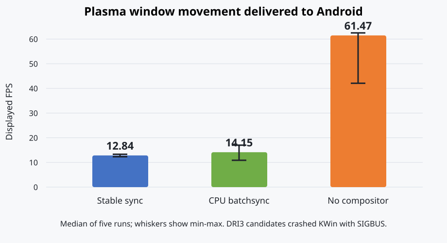
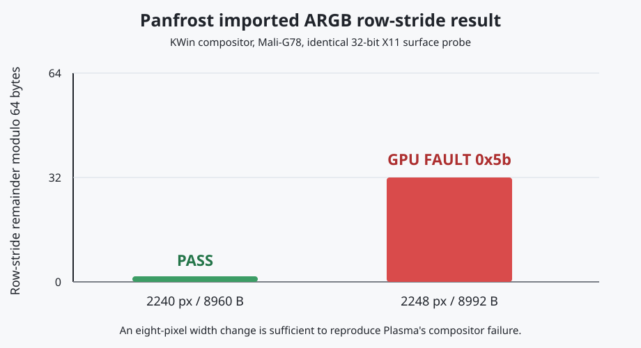

# Tensor G1 performance laboratory

This directory turns performance work into repeatable experiments. The phone
is the device under test, not the place where hypotheses are invented. Expensive
desktop and Firefox runs are promotion tests after smaller probes isolate the
same boundary.

## The four rules

1. **Every boundary gets a cost.** Measure decode, IPC, allocation/import,
   synchronization, copies, render, Present, process CPU/RSS/I/O, scheduling,
   frequency, memory pressure, and visible frame delivery separately.
2. **Change one independent variable.** Use one warm-up and at least five
   measured repetitions. Preserve raw JSONL and compare medians/tails, not the
   most attractive run.
3. **Promote from cheap to expensive.** Start with MediaCodec and the
   browser-free surface-lifecycle probe. Move through VA/FFmpeg and direct X11;
   start stock Firefox only after those pass. Add GNOME last.
4. **Derive coverage from contracts.** Android NDK/CTS, Linux DMA-BUF, VA-API,
   Khronos synchronization, GStreamer Validate, Mesa/dEQP, and browser frame
   timing define the cases. Project-specific probes reproduce only the glue
   between those contracts.

The machine-readable layer and promotion order live in
[`experiments.json`](experiments.json). A run is invalid if it uses network
media, changes multiple knobs, lacks a warm-up, or was captured while the phone
was serving a latency-sensitive hotspot workload.

## Current progress: 2026-07-20

These graphs are the current promotion checkpoint, not a final benchmark. They
record one controlled real-world sequence after component correctness passed;
formal comparisons still require the repetitions and cooldown policy above.


Closing high-RSS Android applications recovered about 1.1 GiB of immediately
available RAM and 1.9 GiB of swap. GNOME and Firefox then ran with more than
1.5 GiB available, so the observed frame loss was not an out-of-memory event.


The local 360p24 clip delivered an estimated 96.5% of source cadence. A
realistic 1920x1080 High-profile 30 FPS, 6.66 Mbit/s stream delivered 94.2%
before sustained testing raised Android to thermal status 3 (`severe`), then
84.6%. In that state the little-cluster policy was capped at 0.738 GHz versus
1.803 GHz hardware maximum and the middle cluster at 1.197 GHz versus 2.253
GHz. Android reported no GPU cooling-device throttle.

The 1920x1080 60 FPS, 27.9 Mbit/s stress stream remains outside the current
bridge's throughput envelope: AHardwareBuffer Present plus release fences, raw
DMA-BUF Present plus release fences, and the CPU presenter without fences all
dropped at least 98.87% in the macro test. This rules out a single Present or
fence switch as the dominant cause. The next structural experiment is direct
MediaCodec surface/AHardwareBuffer output, eliminating the remaining per-frame
NV12 CPU copy. Thermal state must be captured with every future desktop run.

### Plasma window motion



The fixed X11 motion probe separates desktop presentation from application
work. SurfaceFlinger observed only 12.84 displayed FPS with KWin's OpenGL 2
compositor over the stable CPU presenter. Disabling KWin compositing raised the
median to 61.47 FPS and reduced combined KWin, Plasma, and Termux:X11 CPU use
from 0.774 to 0.610 cores, even though the phone was at thermal status 2 rather
than the baseline's status 1. Application OpenGL remained direct, accelerated,
and reported `Mali-G78 (Panfrost)`.

The CPU `batchsync` experiment was not a useful breakthrough (14.15 FPS median,
0.801 cores). Both DMA-BUF/DRI3 KWin candidates failed with `SIGBUS`; therefore
the next compositor task is imported display-target correctness, not more sync
tuning. Until then, `KWIN_COMPOSE=N` is the responsive Plasma default and
`KWIN_COMPOSE=O2` is an explicit diagnostic mode. The full five-run artifacts
and generated report are in
[`results/plasma-motion-20260720/`](results/plasma-motion-20260720/).

Build the deterministic checkerboard window in the PRoot and analyze a result
directory on the development machine:

```sh
cc -std=c11 -O2 -Wall -Wextra -Werror \
  tensor-g1/perf/x11-window-motion.c -lX11 -lm -o /tmp/x11-window-motion
/tmp/x11-window-motion 2 60
python3 tensor-g1/perf/analyze_plasma_motion.py \
  tensor-g1/perf/results/plasma-motion-20260720
```

The probe also records the owner of `_NET_WM_CM_S0`. A nonzero
`compositor_owner` proves that a compositor was active during the run instead
of merely starting and then falling back to an uncomposited desktop.

For Plasma launcher and hover repaint tests, build the bounded XTest probe
against the runtime Xtst library (the minimal image lacks its development
symlink):

```sh
cc -std=c11 -O2 -Wall -Wextra -Werror \
  tensor-g1/perf/x11-menu-hover.c -lX11 -Wl,-l:libXtst.so.6 -lm \
  -o /tmp/x11-menu-hover
/tmp/x11-menu-hover 5 60
```

It opens the application launcher, performs a deterministic pointer sweep, and
does not activate an application. Pair it with the process sampler and
SurfaceFlinger TimeStats rather than judging the injected input rate itself.

### Imported ARGB stride fault



The full Plasma failure is now reproducible without Plasma Shell. KWin safely
composited a 2240-pixel-wide ARGB window whose 8960-byte row stride is divisible
by 64. Increasing only the width to 2248 pixels produced an 8992-byte stride
and immediately reproduced fragment-job event `0x5b`. Both allocations were
large enough for their declared layouts, so this is not an allocation
shortfall or invalid destination.

The same rule explains the desktop failure: Plasma's 2264-pixel-wide ARGB
source uses a tightly packed 9056-byte stride, also 32 bytes past a 64-byte
boundary. KWin's destination uses an aligned 9088-byte stride and remains
valid. Historical Mesa commit `811f8a19469722bea32f3c539b8cf0939fe3b057`
documents this v7+ hardware requirement and the resulting imprecise fault;
commit `4b19725ee525f6f0b5785436680cea63a21445a1` reverted broad rejection because
it broke consumers that supplied such buffers.

Build the minimal reproducer and compare aligned and unaligned widths:

```sh
cc -std=c11 -O2 -Wall -Wextra -Werror \
  tensor-g1/perf/x11-argb-surface.c -lX11 -o /tmp/x11-argb-surface
/tmp/x11-argb-surface 2240 256 1500
/tmp/x11-argb-surface 2248 256 1500
```

Set `PAN_MALI_IMPORT_DEBUG=1` on the compositor to record imported dimensions,
format, row stride, allocation size, computed layout size, and GPU address.
The raw minimal evidence and comparison are in
[`results/argb-stride-20260720/`](results/argb-stride-20260720/).

The safe next experiment is an aligned staging resource for incompatible X
pixmaps. Merely rounding the descriptor stride would make it disagree with the
tightly packed source and is not valid. A selective staging path keeps aligned
video and ordinary application buffers on the direct route instead of forcing
the whole desktop back through CPU presentation.

### Termux:X11 lifecycle fixes

The companion X-server patch is preserved under
[`../termux-x11/`](../termux-x11/). Clearing stale CPU pointers after pixmap
conversion fixed repeated texture-from-pixmap updates. Synchronizing an FD
buffer before its final unmap and close fixed the separate composited-window
destroy fault: ten rapid lifecycle runs and twelve repeated update runs passed.
The release synchronization generally cost about 0.19--0.31 ms. These fixes
make the lifecycle tests reliable; they do not relax the imported-texture
stride requirement above.

`firefox-loop-player.html` now separates `displayed_fps`, derived from
`VideoPlaybackQuality`, from `presented_fps`, the main-thread
`requestVideoFrameCallback` callback rate. It also records callback frame span
and coverage so observer lag is not mislabeled as compositor frame loss. The
unedited device captures preserve the
[GNOME baseline](../screenshots/gnome-realworld-baseline.png), the
[1080p60 failure](../screenshots/gnome-firefox-ahb-realworld.png), and the
[corrected severe-thermal 1080p30 result](../screenshots/gnome-firefox-1080p30-probe-v2.png).

## Cost map

| Layer | Cheap probe | What it isolates | Promotion signal |
| --- | --- | --- | --- |
| Codec | `mediacodec-decode` byte-buffer and AImageReader modes | Exynos throughput, output delay, AHB acquisition/fence | Sustained rate exceeds source FPS; all frames and EOS |
| Bridge | `bridge-client` | compressed IPC plus raw-frame IPC | No loss; quantify bytes and CPU |
| Surface lifecycle | `surface-lifecycle-bench` | DMA-heap registration and Firefox-like submit/ACK/export ordering | 100% shared frames and `protected_at_ack_percent`; stable P95 ACK |
| VA | `run-vaapi-correctness.sh` | H.264 translation, PTS, DMA-BUF layout, EOS teardown and correctness | Hardware and software frame rows match; all processes exit cleanly |
| Presentation | fixed EGL/GLX probes and fixed glmark2 scenes | Panfrost, import, DRI3/Present, Termux:X11 | Correct pixels; stable frame-time tail and X11 CPU |
| Browser | local MP4 and `firefox-loop-player.html` | Firefox RDD/VA, compositor and visible delivery | Source-rate `displayed_fps`, low drops, and adequate callback coverage without GNOME |
| Desktop | GNOME plus local Firefox under Perfetto | scheduler, frequency, Mutter and complete UI economics | No new jank/thermal regression |

This prevents an end-to-end number from hiding a trade such as “fewer socket
bytes but more CPU copies” or “higher decode FPS but a worse Present tail.”

## In-process MediaCodec economics

Build the service as documented in `../media-codec/README.md`, then opt in to
aggregate metrics:

```sh
TENSOR_PERF_OUTPUT="$PREFIX/tmp/service.jsonl" \
TENSOR_MEDIACODEC_REMAP_LATEST=1 \
./mediacodec-service "$PREFIX/tmp/tensor-mediacodec.sock"
```

Instrumentation is off when `TENSOR_PERF_OUTPUT` is unset. When enabled it
does one monotonic clock read around each measured operation and emits only an
aggregate at client teardown. It records:

- protocol header/payload receive time and bytes;
- codec configure/start, input dequeue/copy/queue and output dequeue;
- DMA-BUF sync-start, clear, Y copy, UV copy and sync-end separately;
- release-fence arm/import and signal/reap time;
- surface registration, frame send, ACK send and codec stop;
- frame/byte counts, empty output polls, shared frames and dirty PTS remaps.

That makes the remaining MediaCodec-to-DMA-BUF copy directly comparable with
the AImageReader/AHardwareBuffer zero-copy candidate.

## Firefox without Firefox

`surface-lifecycle-bench.c` sends the same fundamental sequence that exposed
the Firefox failure:

```text
register DMA-BUF surface -> submit H.264 access unit -> wait for frame/ACK
                                             -> browser may export after ACK
```

Build it in Jammy:

```sh
cc -std=c11 -O2 -Wall -Wextra -Werror \
  -Itensor-g1/media-codec \
  tensor-g1/media-codec/surface-lifecycle-bench.c \
  -o surface-lifecycle-bench
```

Add the surfaceless EGL consumer to reproduce Firefox's separate decoder and
compositor progress without starting X11 or a browser:

```sh
cc -std=c11 -O2 -Wall -Wextra -Werror -DTMC_EGL_CONSUMER \
  -Itensor-g1/media-codec \
  tensor-g1/media-codec/surface-lifecycle-bench.c \
  tensor-g1/media-codec/egl-nv12-consumer.c \
  -lEGL -lGLESv2 -o surface-lifecycle-egl-bench
```

The parent keeps feeding MediaCodec while a forked worker imports each NV12
DMA-BUF as R8/GR88 and samples it with Panfrost. The worker captures a pixel at
the actual ACK boundary; after EOS, the parent compares that capture with the
finalized surface. This avoids an invalid oracle where CPU and GPU both agree
on the same stale preinitialized bytes. Small correctness streams need one
surface per access unit, up to the probe's 64-surface limit.

Run against a local Annex-B stream; the optional pool size defaults to eight:

```sh
./surface-lifecycle-bench /tmp/tensor-mediacodec.sock \
  /tmp/tensor-1080p60-annexb.h264 1920 1080 60 8 \
  | tee surface-lifecycle.jsonl
```

The JSON record reports decode rate, P50/P95/max packet-to-ACK latency, first
output depth, shared versus raw frames, matching readiness, pending DMA-BUF
write fences, and `protected_at_ack_percent`. A surface is protected when its
matching frame is already ready or `poll(POLLIN)` proves an implicit writer
fence still blocks readers. It allocates a pool once, so it does not add a
per-frame allocation or initialization copy that Firefox does not perform.

The reusable Termux runners keep the modes and repetition structure fixed:

```sh
tensor-g1/perf/run-codec-bench.sh INPUT.h264 OUT 5 \
  byte-buffer private-ahb cpu-readable-ahb

TENSOR_SERVICE="$HOME/mediacodec-service" \
tensor-g1/perf/run-lifecycle-bench.sh INPUT.h264 OUT 5 \
  strict release-fence

TENSOR_SERVICE="$HOME/mediacodec-service" \
tensor-g1/perf/run-vaapi-correctness.sh INPUT.h264 OUT 360

TENSOR_EGL_CLIENT=/tmp/surface-lifecycle-egl-bench \
TENSOR_PANFROST_DRIVER_PATH=/path/to/staged/dri \
tensor-g1/perf/run-egl-consumer-bench.sh INPUT-16F.h264 OUT 5 off on
```

On the Pixel 6a, three measured 360-frame 1080p60 runs produced 100% protected
exports, 360/360 strict PTS-mapped shared frames, zero unsafe ACK boundaries,
and 135.2 FPS median with Kbase release fences after region-only padding clears.
The original fenced implementation cleared 3.13 MB per frame and reached
129.5 FPS; clearing only uncovered row tails reduced that work to 22.9 KB and
12.9 microseconds per frame. The unfenced strict baseline protected only 11.1%
at 130.6 FPS. `remap-latest` is rejected: its probe sent 65/360 frames through
the raw fallback and assigned delayed output to newer surfaces.

`run-vaapi-correctness.sh` starts the native service, decodes the same local
stream through hardware VA-API and software FFmpeg, compares normalized
`framemd5` rows, and rejects nonzero client/service exits or teardown crash
markers. The current 360-frame promotion matched every PTS, duration, size and
MD5 and completed cleanly after the VA driver sent MediaCodec EOS and waited
for output EOS. Set `TENSOR_VA_DRIVER_PATH` or `TENSOR_SERVICE` to test staged
binaries without replacing the installed path.

Use this probe to tune output waiting, remapping, pool depth, direct AHB output,
and fence transport. Only start Firefox after the probe shows the intended
ordering and frame count.

### Rootless Panfrost consumer synchronization

The Kbase path has no accessible DRM render node, so Mesa's normal renderonly
scanout bookkeeping and DMA-BUF fence capability probe never attach imported
NV12 resources to a batch. `PAN_MALI_DMABUF_SYNC_WAIT=1` is an opt-in dirty
fallback: imported Kbase BO file descriptors are tracked even without a
`scanout` when used as read resources, and the JM submit path waits for
`POLLIN` before submitting a batch that samples them. The variable is scoped to Firefox only when the matching
MediaCodec release-fence mode is selected.

In three matched 16-frame 1080p60 runs, the disabled control sampled 41/48
surfaces before their writer fence and all 41 pixels differed from the
finalized surfaces. With the wait enabled, 0/48 samples completed early and
0/48 pixels differed. Median GPU-sample P50 moved from 1.02 to 2.47 ms and P95
from 3.24 to 38.09 ms because the consumer now pays real decoder/reorder wait
time. Median decode throughput moved from 209.7 to 204.3 FPS (-2.6%). A
one-pixel render-target warm-up also removed an independent intermittent first
draw that returned an all-zero RGBA pixel; five enabled runs then produced
80/80 correct finalized samples.

The Linux DMA-BUF contract requires `DMA_BUF_IOCTL_SYNC` around mmap CPU access
even after execution fences are handled. The service now starts its CPU write
epoch before importing the pending writer fence, ends the epoch before
signaling that fence, and the probe brackets its finalized CPU read. In the
16-frame contract run, START averaged 1.74 microseconds and END averaged 3.24
microseconds per frame; the 360-frame VA promotion still matched software
byte-for-byte with clean teardown.

This is a correctness-first userspace fallback, not an upstream-quality
solution. It blocks the submitting compositor thread. The cleaner follow-up is
to express the imported `sync_file` as a Kbase JM soft-fence dependency so CPU
submission can continue asynchronously.

## Low-overhead process economics

Run the sampler inside Termux or the PRoot so it can read same-UID `/proc`
entries:

```sh
python3 tensor-g1/perf/process_sampler.py \
  --duration 12 --interval-ms 250 \
  --match 'mediacodec-service|surface-lifecycle-bench|firefox|Xwayland|termux-x11' \
  --output process.jsonl
```

The artifact contains raw CPU ticks, RSS, I/O, thread count, and voluntary and
involuntary context switches. The final record reports the sampler's own CPU
cost. A run with excessive observer cost can therefore be rejected rather than
trusted.

Summarize one run or compare a candidate with a baseline on the Mac:

```sh
python3 tensor-g1/perf/compare_runs.py process.jsonl
python3 tensor-g1/perf/compare_runs.py candidate.jsonl \
  --baseline baseline.jsonl > comparison.md
```

Service, process, and benchmark JSONL may be concatenated into one artifact.
All use the `tensor-perf-v1` schema.

## Short system forensics

Use Perfetto only after the cheap run identifies a system-level question. The
checked-in 12-second config records scheduling/wakeup, CPU frequency/idle,
process and system memory counters, graphics/view/Binder atrace categories,
DMA-fence events when exposed by the production kernel, and Android
FrameTimeline:

```sh
tensor-g1/perf/capture_perfetto.sh out/run.perfetto-trace \
  /path/to/platform-tools/adb
```

If the kernel rejects an unavailable ftrace event, remove only that event from
a copy of the config and preserve the effective config beside the trace.
Perfetto is a forensics artifact, not the default benchmark: Android documents
roughly microsecond-scale cost for each ATrace event, while scheduler tracing
also creates a much larger result.

## Experiment record

Each comparison should preserve this small ledger beside its artifacts:

```text
id:
commit:
device build / temperature / battery:
layer:
hypothesis:
independent variable:
fixed inputs:
warm-up:
repetitions:
primary metric and budget:
correctness oracle:
result:
decision: keep | reject | investigate
artifact paths:
```

Performance changes must keep a correctness oracle: frame count/EOS at the
codec layer, `framemd5` at VA, known pixels at graphics import, and dEQP or
fixed scene validation at GL. Faster corruption is a failed run.

## Upstream/spec-derived coverage

Use these as the source of cases and semantics, then keep only the subset that
exercises this rootless bridge:

- [Android NDK media APIs](https://developer.android.com/ndk/reference/group/media):
  MediaCodec and asynchronous AImageReader acquisition/fence/lifetime rules.
- [AOSP media CTS tree](https://android.googlesource.com/platform/cts/+/refs/heads/main/tests/tests/media/):
  decoder combinations, EOS/flush/reconfiguration, timestamps, surface output,
  malformed inputs, and lifecycle cases.
- [AOSP ImageReader decoder test](https://android.googlesource.com/platform/cts/+/android-5.1.1_r1/tests/tests/media/src/android/media/cts/ImageReaderDecoderTest.java):
  compare MediaCodec buffer and ImageReader output and bound outstanding images.
- [Linux DMA-BUF documentation](https://docs.kernel.org/driver-api/dma-buf.html):
  cache maintenance is not execution synchronization; implicit fences may be
  waited through `poll`, while explicit users need a `sync_file` or API fence.
- [EGL Android native-fence extension](https://registry.khronos.org/EGL/extensions/ANDROID/EGL_ANDROID_native_fence_sync.txt):
  fence-FD ownership and signal semantics for an eventual explicit bridge.
- [GStreamer Validate](https://gstreamer.freedesktop.org/documentation/gst-devtools/gst-validate-launcher.html):
  reusable play/seek/flush/error scenarios and media reference files.
- [Mesa performance tracing](https://docs.mesa3d.org/u_trace.html) and the
  repository's dEQP infrastructure: GPU-stage timing and graphics correctness.
- [video frame callback specification](https://wicg.github.io/video-rvfc/):
  callbacks mean a frame was presented for composition and can expose callback
  gaps or late expected-display times; they are not decoder-throughput counters.
- [Perfetto Android tracing](https://perfetto.dev/docs/getting-started/system-tracing):
  scheduler/frequency/process counters and trace analysis for the final macro run.

The first imported case groups should be: low-delay versus reordered H.264,
EOS with delayed frames, flush/restart, seek, resolution/stride change, surface
pool exhaustion, disconnect mid-frame, explicit fence delay, and a 10-minute
local stability loop. Network/YouTube remains a product smoke, never a decoder
benchmark.
