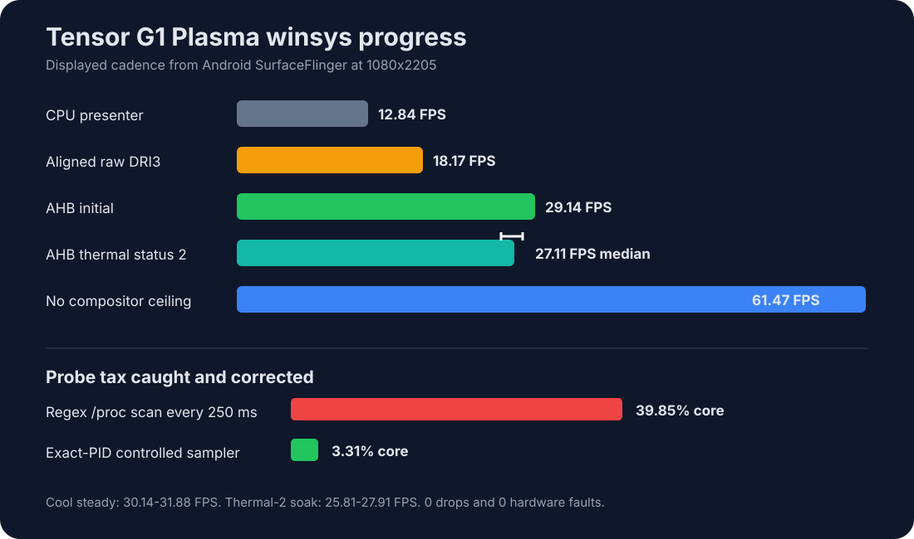
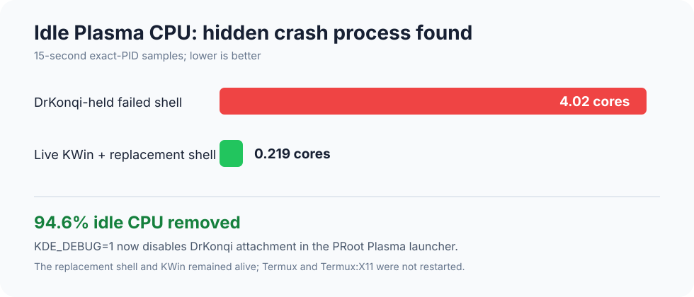

# Tensor G1 AHardwareBuffer winsys checkpoint

This checkpoint measures full Plasma 5 compositing at 1080x2205 through
Termux:X11. Panfrost renders its display targets directly into Android
`AHardwareBuffer` allocations, exports the private socket transport modifier,
and Termux:X11 imports the native handle for its GPU Present copy.

| Path | Window-motion FPS | KWin + Plasma CPU | Notes |
| --- | ---: | ---: | --- |
| CPU presenter reference | 12.84 | 0.774 cores | Five-run earlier reference, thermal status 1 |
| Aligned raw DMA-BUF DRI3 | 18.17 | 0.815 cores | Single matched run; Termux:X11 still uploads the source |
| AHardwareBuffer DRI3 | **29.14** | **0.771 cores** | Single matched initial run; 0 dropped frames |
| AHardwareBuffer DRI3 soak | **27.11 median** | 0.690 cores | Five runs, 25.81-27.91 FPS, thermal status 2 throughout |
| No KWin compositor reference | 61.47 | 0.610 cores | Five-run ceiling reference, thermal status 2 |

The matched AHardwareBuffer run improved delivered window-motion cadence by
60.4% over aligned raw DRI3 and reduced combined KWin plus Plasma CPU by 5.3%.
The thermal-status-2 soak still remained 49.2% above the raw DRI3 reference,
but references captured at different thermal states are shown as progress
markers rather than a formal A/B result.

After stale-shell cleanup allowed Android to cool back to status 1, five
stabilization runs rose monotonically from 24.54 to 30.99 FPS. They are warm-up
evidence, not repetitions. The following two steady status-1 runs delivered
31.88 and 30.14 FPS. The third fell to 22.53 FPS while Android crossed from
thermal status 1 to 2, and the gate stopped the remaining runs. No five-run
cool median is claimed.

The launcher-hover sample moved from 45.17 FPS on aligned raw DRI3 to 46.81
FPS on AHardwareBuffer. The deterministic hover probe now sends Escape before
and after each run so an interrupted or previous run cannot invert the menu
state.

## Why compositing still trails the uncomposited ceiling

The 61.47 FPS result is an upper-bound diagnostic, not equal work with only a
small KWin cost removed. The motion probe repositions an already painted X
window. Without compositing, the X server can update that window directly.
With KWin, each move damages the scene, Panfrost renders a new compositor
frame, DRI3 Presents that frame, Termux:X11 copies it into its root buffer,
and the Android renderer draws the root buffer into its EGL surface.

The cool AHardwareBuffer results of 30.14 and 31.88 FPS correspond to roughly
33.2 and 31.4 ms per displayed frame, while 61.47 FPS is 16.3 ms per frame.
That near-two-refresh cadence, combined with only a small process-CPU
difference, points to serialized presentation or a missed-vblank cliff rather
than CPU saturation.

Termux:X11's existing `loriePresentFlip` eligibility test also compares
`root.width` with both the incoming pixmap width and height. A 1080x2205
full-screen pixmap therefore always fails direct-flip eligibility. Correcting
the second comparison to `root.height` is a candidate, not yet a promoted fix:
the earlier strict no-copy route exposed invisible or corrupted output, so
buffer ownership, release timing, damage, resize, and orientation behavior
must pass a small full-screen AHardwareBuffer flip probe before enabling it for
KWin. The next instrumentation boundary is KWin render completion, Present
submission, Termux:X11 copy/fence completion, and Android `eglSwapBuffers`.

## Measurement correction

The first repeated soak used `--match`, which made the original sampler scan
every `/proc` entry every 250 ms under PRoot. Its own measured cost was 39.85%
of one CPU core, making those process-cost samples invalid. PID discovery is
now cached for five seconds, and the controlled winsys run used exact KWin and
plasmashell PIDs. Observer cost fell to a 3.31% median.

## Idle crash-handler audit

An apparently idle Plasma session initially consumed 4.02 CPU cores. The
per-thread split showed four 100% threads in plasmashell PID 4842. The session
log confirms that this shell had aborted, DrKonqi had restarted it as PID
15955, and the failed ptrace-traced parent never exited. Terminating only the
stale shell and its crash reporter reduced measured KWin plus live plasmashell
idle use to 0.219 cores (-94.6%).

The session launcher now exports `KDE_DEBUG=1`, KDE's documented opt-out for
installing the KCrash/DrKonqi handler. Under PRoot this makes a future failure
exit normally and remain visible in the session log instead of turning into a
hidden four-core thermal load. The log's atom event `0x04` is
`BASE_JD_EVENT_TERMINATED`, emitted while the aborted process tears down its
GPU context; it is not a hardware fault code.

## Stability evidence

- Five controlled motion runs completed with no SurfaceFlinger drops.
- Android remained at thermal status 2; maximum reported `skin_therm1`
  increased from 44.55 to 44.94 C across the run.
- The 33-width allocation/import/present lifecycle matrix passed before this
  macro promotion: 33/33 cases, no raw fallback, and no GPU fault.
- The broker's deliberately abandoned Present socket closed after 5003 ms and
  its allocation returned to the pool.
- A deliberately exited allocation owner was reclaimed on the next request,
  and 17 incompatible released sizes forced safe pool eviction without
  `ENOSPC`.
- The full Plasma screenshot is preserved as `plasma-ahb-stable.png`.

Raw SurfaceFlinger TimeStats, thermal dumps, process JSONL, and motion-probe
JSONL are stored beside this report, including the rejected warm-up and the
thermal-gated steady sequence.
