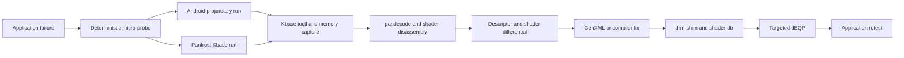

# Tensor G1 differential reverse-engineering loop

This directory applies the Panfrost bring-up workflow to Tensor G1 without
using Blender as the first diagnostic. Each suspected driver defect is reduced
to a deterministic micro-probe, captured on Android's proprietary Mali stack
and Panfrost, decoded, and promoted into a regression test.

## Evidence loop



The order is deliberate. A Blender retry is justified only after the focused
probe and its regression coverage pass.

## First case: Blender particle hair

The original crash reached `panfrost_new_texture_v9()` while Blender updated
particle hair. The smallest relevant contract is:

1. Bind a buffer object as `GL_EXT_texture_buffer`.
2. Fetch deterministic texels in a vertex shader.
3. Capture those values with transform feedback.
4. Map the transform-feedback buffer and compare exact bytes.

`../probes/buffer-texture-xfb.c` covers `RGBA32F`, `R32UI`, `R16UI`, an aligned
non-zero `glTexBufferRangeEXT`, and two interleaved integer transform-feedback
varyings with a 12-byte vertex stride. It prints JSON Lines with renderer
identity, exact expected/actual hashes, GL error, initialization cost, and
draw-plus-finish time. This makes results from the two drivers directly
diffable.

Use `TENSOR_PROBE_CASE=<case>` to isolate one variable and
`TENSOR_PROBE_REPEAT=<count>` to obtain a failure rate without repeatedly
starting EGL. For example:

```sh
TENSOR_PROBE_CASE=r32ui_range TENSOR_PROBE_REPEAT=100 \
  ./buffer-texture-xfb
```

## Capture matrix

Store every run under `results/<case>/<stack>/<date>/` with:

- `result.jsonl`: probe output and timings.
- `ioctl.strace*`: process-local Kbase open/ioctl/mmap/poll chronology.
- `pandecode.log`: decoded Panfrost job descriptors and shader disassembly.
- `memory.dump`: raw mappings only when needed.
- `manifest.txt`: Mesa commit, Android build, GPU ID, probe hash and command.

Run a bounded Panfrost capture with:

```sh
TENSOR_CAPTURE_DIR=results/hair/panfrost/current \
  ./capture-kbase.sh env \
  PAN_MESA_DEBUG=trace,dump \
  TENSOR_PROBE_PLATFORM=surfaceless \
  ./buffer-texture-xfb
```

`PAN_MESA_DEBUG=trace` feeds current Mesa allocations and JM command streams
to pandecode. Add `dump` only to a minimal probe because it writes all tracked
GPU memory. `capture-kbase.sh` uses `strace` for calls made by the launched
process; Android SELinux may prevent attaching to unrelated applications.

For the proprietary baseline, build the same GLES source as a native Android
binary, select `TENSOR_PROBE_PLATFORM=android`, and launch it under a
process-local ioctl/panwrap capture. Never infer proprietary descriptor fields
from Panfrost output alone.

`panwrap-lite.c` is the first process-local capture layer. It follows
Collabora's documented method of identifying the Mali fd through
`/proc/self/fd`, intercepts only `/dev/mali0` ioctls, records bounded before and
after argument bytes, timings, decoded ioctl metadata, and copies the userspace
JM atom array at `JOB_SUBMIT`. It deliberately does not chase GPU pointers yet.
Build and run it natively in Termux/Bionic:

```sh
PANWRAP_LITE_SRC=./panwrap-lite.c \
PANWRAP_LITE_OUT="$HOME/panwrap-lite.so" \
  ./build-panwrap-lite.sh

TENSOR_PROBE_REPEAT=5 ./run-android-hair-probe.sh
```

The Bionic route is intentional. The glibc/libhybris EGL experiment corrupts
the userspace stack before the first Kbase call, so it cannot be used as a
reference capture. The direct Android EGL/GLES process runs the same probe on
the proprietary Mali driver and keeps the capture boundary trustworthy.

## Patch rule

Classify every observed difference before changing code:

- API or shader output difference: first check the GLES specification and a
  targeted dEQP case.
- Shader binary difference: reduce the shader further, compare Valhall
  disassembly, then add the shader to shader-db.
- Descriptor difference: identify the field with repeated one-variable
  experiments, document it in Panfrost GenXML, and use generated pack/unpack
  helpers in the fix.
- Kbase lifecycle difference: update the Kbase adapter and preserve a compact
  ioctl-sequence regression trace.

Unknown bits are not copied into C as magic constants. A descriptor field is
accepted only after differential evidence gives it a stable meaning.

## Validation ladder

```text
micro-probe -> drm-shim -> shader-db -> targeted dEQP -> Blender hair
```

Use `PAN_GPU_ID=9202` for the Tensor G1 drm-shim model once the shim table has
that model. drm-shim validates command generation and compiler behavior but
does not replace the real-hardware Kbase run. Targeted dEQP is selected from
the failing feature (texture-buffer formats, texelFetch, transform feedback,
buffer mapping and synchronization), not from a full-suite guess.

## Current evidence: 2026-07-22

All exact comparisons below use four vertices. The first 100-iteration run
predates the range and interleaved cases.

| Case | Proprietary pass | Panfrost pass | Proprietary median | Panfrost median |
| --- | ---: | ---: | ---: | ---: |
| `RGBA32F` buffer texture to XFB | 100/100 | 100/100 | 762 us | 1,087 us |
| `R32UI` buffer texture to XFB | 100/100 | 100/100 | 787 us | 1,080 us |
| `R16UI` buffer texture to XFB | 100/100 | 100/100 | 811 us | 1,129 us |
| `R32UI` aligned range, isolated | 100/100 | 100/100 | 1,840 us | 2,144 us |
| two XFB varyings, stride 12 | 5/5 | 5/5 | not yet baselined | not yet baselined |

```mermaid
xychart-beta
    title "Median draw plus finish time for first 100 exact passes"
    x-axis ["RGBA32F", "R32UI", "R16UI"]
    y-axis "microseconds" 0 --> 1300
    bar [762, 787, 811]
    bar [1087, 1080, 1129]
```



The first bar is Android's proprietary driver and the second is Panfrost.

The native proprietary capture now records a stable four-atom, 64-byte-stride
`JOB_SUBMIT` for each basic draw. The matching Panfrost `PAN_MESA_DEBUG=trace`
dump and the `PAN_GPU_ID=9202` drm-shim dump have the same decoded resource
types, `R32UI RGB1` conversion, 4-byte stride, compute dimensions, and Valhall
instructions after GPU addresses are normalized. Expected differences are the
hardware-written completion status and allocation addresses. drm-shim is a
command-generation check; its readback must fail because the no-op shim does
not execute the job.

`compare-pandecode.py REFERENCE CANDIDATE` performs that normalization and
hashes descriptor semantics and shader instructions separately. The current
real-versus-shim range capture matches both hashes exactly.

One five-iteration mixed run originally produced a wrong range hash immediately
after Kbase reported atom event `0x04` (`BASE_JD_EVENT_TERMINATED`). The root
cause was in the Kbase winsys rather than a Valhall descriptor: the adapter used
atom ID `0`, but the JM ABI reserves dependency ID zero for "no dependency".
The first fragment atom could therefore run before its vertex/tiler atom. The
adapter now reserves zero, uses IDs 1 through 255, and drains outstanding atoms
before wrapping.

Two related adapter fixes were required: translate `kbase_wait_bo()`'s
zero-on-ready return to Mesa's true-on-ready contract, and keep Kbase SAME_VA
mappings alive while BOs reside in Gallium's cache. After those fixes, without
`PAN_MESA_DEBUG=sync` or tracing:

- the formerly unstable 512-byte dEQP texture-buffer case passed 5/5 fresh
  processes;
- the 11-case texture-buffer group passed 33/33 across three fresh processes;
- all six buffer-texture/transform-feedback probe variants passed 600/600,
  crossing the 1..255 atom range several times;
- the orphan-after-bind case passed 100/100 on both proprietary Mali and
  Panfrost with identical output hashes.

The corresponding GLES31 geometry-shader transform-feedback group is
`NotSupported` because this Panfrost context does not expose
`GL_EXT_geometry_shader`; it is not counted as passing coverage.

What the evidence currently rules out:

- basic buffer-texture descriptors for `RGBA32F`, `R32UI`, and `R16UI`;
- the reported 64-byte texture-buffer range alignment;
- one aligned non-zero range;
- basic transform-feedback readback;
- two interleaved integer varyings with a 12-byte stride.

No GenXML field has been changed: there is not yet a stable proprietary versus
Panfrost descriptor difference to encode.

## Blender application gate

Blender 3.0.1 loads `fishy_cat.blend` in background mode and reports 54 objects
and 13 particle systems. Its interactive UI and Eevee renderer require desktop
OpenGL 3.3 geometry shaders. The unforced driver correctly advertises OpenGL
3.1 and zero geometry output capacity. Forcing a 3.3/GLSL 330 version lets
Blender start, but its unconditional armature-overlay shader and Eevee cube
downsample shader fail compilation and Blender then segfaults in its draw
manager. The same UI crash occurs with Blender's factory cube, proving it is
independent of the cat hair scene.

Upstream's `src/poly` geometry implementation is not currently connected to
the Panfrost Gallium driver. Do not fake geometry limits or classify this as a
hair descriptor failure. A practical application retest requires either that
integration or a Blender build/path that does not require geometry shaders.

## Bring-up facts

- Raw Kbase GPU ID: `0x92020010`.
- Decoded product key: `PAN_PROD_ID(9, 2, 2)` (`0x090202`).
- The isolated branch now recognizes that product and reaches real JM command
  submission on `/dev/mali0`.
- The in-tree no-op drm-shim needed `L2_FEATURES` and allowed-priority answers
  before current upstream Mesa could generate G78 jobs under
  `PAN_GPU_ID=9202`.

Mesa's Panfrost drm-shim documentation describes using the shim for shader-db
and surfaceless targeted dEQP. The in-tree current reference is
`docs/drivers/panfrost/drm-shim.rst`.

## References

- [Collabora: Reverse-engineering the Mali-G78](https://www.collabora.com/news-and-blog/news-and-events/reverse-engineering-the-mali-g78.html)
- [Mesa Panfrost drm-shim documentation](https://docs.mesa3d.org/drivers/panfrost/drm-shim.html)
