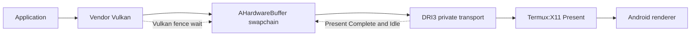
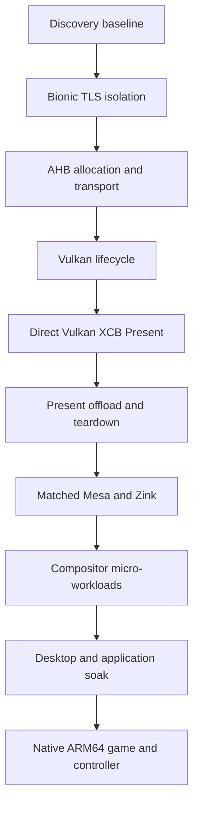

# WSI maturity tracker

The runtime keeps Ginkage and xMeM selectable. xMeM is the small upstream WSI
oracle being hardened here; passing it does not remove Ginkage or force an
installed distribution to use one acceleration route. Profile selection and
rollback remain explicit.

## Resolved in the Exynos proof

| Contract | State | Evidence |
| --- | --- | --- |
| Image memory requirements | Fixed | Allocation size and memory-type bits now come from the created Vulkan image |
| Cleanup initialization | Fixed | Memory, layout, pixmap, and AHB fields start in a safe empty state |
| Image identity | Fixed | Deferred allocation binds the original application-visible `VkImage`; it no longer creates and leaks a replacement image |
| Surface format contract | Fixed | Surface enumeration advertises only AHB-exportable formats; the selected format remains identical through image-view creation, allocation, and transport |
| Color encoding | Fixed | BGRA sRGB maps to RGBA sRGB instead of silently becoming UNORM |
| Channel semantics | Fixed | Paired modifiers `1257` and `1255` identify negotiated RGBA and BGRA content |
| Teardown wake | Fixed | A Present MSC notification wakes the event thread before join |
| Bounded AHB handshake | Fixed | Producer and server use three-second poll deadlines; withheld-handle fault returned after 3002 ms and X recovered immediately |
| Direct presentation | Pass | Mali-G72 red frame, clean exit, 1/1 Termux:X11 Present copies GPU-offloaded |
| Rapid lifecycle soak | Pass | 25/25 image views and swapchains reached clean exit; 25/25 Present copies were GPU-offloaded in an isolated log run |
| Narrow AHB provider | Pass | `libnativewindow.so` passed 9/9 AHB transport cases on Exynos 9611; `libandroid.so` aborted while loading its framework/crypto dependency graph |
| Explicit acquire ordering | Pass | 25/25 delayed Vulkan sync-file Presents withheld completion before release and completed 16–39 ms after release |

## Promotion gates still open

1. Promote the validated explicit acquire fence from an opt-in only after the
   paired WSI/server protocol is versioned and runtime probing has selected a
   matching server. The CPU wait remains the mismatch fallback.
2. Carry the display-consumer release fence back to image reuse. Present
   Complete and Idle currently provide lifecycle ordering, but the private
   transport does not yet return an Android release `sync_file` payload.
3. Advertise only presentation modes whose semantics are implemented. MAILBOX
   needs real queued-frame replacement; until then FIFO is the release target.
4. Correctly handle resize, surface loss, retired swapchains, Present serial
   wrap, and X connection teardown under repeated stress.
5. Version the paired private transport and reject mismatched WSI/server builds
   with a clear diagnostic rather than corrupted output.

## Qualification sequence

Every device/build pair advances independently:

No later pass erases an earlier failure. Performance results are compared only
between runs with the same resolution, presentation mode, thermal state, and
workload definition.

The final application qualification includes a visually demanding native
ARM64 game at the highest practical graphics settings. It must record frame
pacing, thermal behavior, the selected GPU path, and Android game-controller
button, axis, trigger, and hot-plug behavior. This is a post-compositor gate;
it must not substitute for the smaller deterministic probes above.
