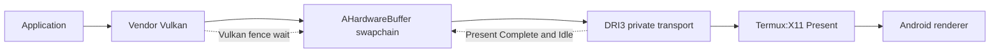
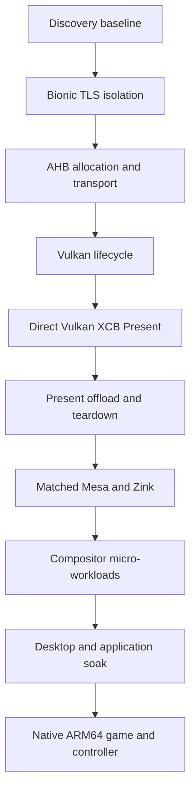

# WSI maturity tracker

The runtime keeps Ginkage and xMeM selectable. xMeM is the small upstream WSI
oracle being hardened here; passing it does not remove Ginkage or force an
installed distribution to use one acceleration route. Profile selection and
rollback remain explicit.

## Resolved in the Exynos proof

| Contract | State | Evidence |
| --- | --- | --- |
| Image memory requirements | Fixed | Allocation size and memory-type bits now come from the created Vulkan image |
| Cleanup initialization | Fixed | Memory, layout, pixmap, and AHB fields start in a safe empty state |
| Image identity | Fixed | Deferred allocation binds the original application-visible `VkImage`; it no longer creates and leaks a replacement image |
| Surface format contract | Fixed | Surface enumeration advertises only AHB-exportable formats; the selected format remains identical through image-view creation, allocation, and transport |
| Color encoding | Fixed | BGRA sRGB maps to RGBA sRGB instead of silently becoming UNORM |
| Channel semantics | Fixed | Paired modifiers `1257` and `1255` identify negotiated RGBA and BGRA content |
| Teardown wake | Fixed | A Present MSC notification wakes the event thread before join |
| Bounded AHB handshake | Fixed | Producer and server use three-second poll deadlines; withheld-handle fault returned after 3002 ms and X recovered immediately |
| Direct presentation | Pass | Mali-G72 red frame, clean exit, 1/1 Termux:X11 Present copies GPU-offloaded |
| Rapid lifecycle soak | Pass | 25/25 image views and swapchains reached clean exit; 25/25 Present copies were GPU-offloaded in an isolated log run |
| Narrow AHB provider | Pass | `libnativewindow.so` passed 9/9 AHB transport cases on Exynos 9611; `libandroid.so` aborted while loading its framework/crypto dependency graph |
| Explicit acquire ordering | Pass | 25/25 delayed Vulkan sync-file Presents withheld completion before release and completed 16–39 ms after release |
| Present source release ordering | Pass | Termux:X11 waits for its GLES copy fence before emitting IdleNotify; xMeM passes no idle fence, so Present's standard pixmap-reuse guarantee applies |
| Contended renderer lock clock | Fixed | 25/25 on-device probes passed; waiting-thread CPU fell from 49,760 us to 190 us on average while lock latency remained approximately 50 ms |
| GPU-copy hot-path logging | Fixed | Normal mode emitted 0 per-rectangle logs after the gate, versus 58 writes during the earlier one-second 60-frame run |
| Serialized steady Present | Pass | Five consecutive 60-frame runs completed cleanly at 60.10-63.14 FPS (61.79 FPS mean) with explicit acquire synchronization enabled |
| Paired protocol discovery | Pass | Root property probe reported version 1, all four capability bits, modifiers 1255/1257, and `compatible=true` |
| Automatic acquire selection | Pass | With no sync override, xMeM selected a sync-file fence and completed 60 frames at 60.18 FPS with a clean exit; `UDROID_X11_EXPLICIT_SYNC=0` selected the CPU-wait fallback and also exited cleanly |
| Present thread ownership | Fixed | Special-event and run state are initialized, thread construction owns the run transition, teardown joins by `joinable()`, and partial setup unwinds registrations |
| Immediate swapchain teardown | Pass | 100/100 swapchains were created and destroyed before first acquire/Present with a clean process exit; a post-fix 60-frame regression passed at 62.28 FPS |
| Resize and swapchain retirement | Pass | 20/20 independent processes resized 480x320 to 576x384, created a replacement with `oldSwapchain`, rendered afterward, and exited cleanly; Termux:X11 reported 69/69 sampled Present copies GPU-offloaded |

## Promotion gates still open

1. Replace the server's synchronous GLES fence wait with an asynchronous
   `EGL_ANDROID_native_fence_sync` wait without weakening Present IdleNotify's
   pixmap-reuse guarantee. The source is safe today, but the renderer holds the
   shared destination lock while waiting; an async design must also prevent X
   CPU writes to root or redirected destinations until that native fence
   signals.
2. Advertise only presentation modes whose semantics are implemented. MAILBOX
   needs real queued-frame replacement; until then FIFO is the release target.
3. Correctly handle surface loss, Present serial wrap, and X connection
   teardown under repeated stress. Resize and retired-swapchain replacement now
   pass their first deterministic stress gate.
4. Move the protocol probe and WSI failure reason into automatic profile
   selection so a mismatched or older server selects another graphics route
   before a desktop is launched.
5. Repeat the complete ladder on the Tensor, second Exynos, and MediaTek test
   devices before promoting this profile beyond experimental status.

The synchronization model follows Android's acquire/release fence contract:
producers must not reuse a buffer until its consumer is done. In this copy-based
X11 path, delayed Present IdleNotify is the current release signal. Android's
native fence API is the planned optimization mechanism, not permission to emit
IdleNotify early. See the
[AOSP synchronization framework](https://source.android.com/docs/core/graphics/sync)
and the pinned Xorg `presentproto.txt` in the Termux:X11 source.

## Qualification sequence

Every device/build pair advances independently:

No later pass erases an earlier failure. Performance results are compared only
between runs with the same resolution, presentation mode, thermal state, and
workload definition.

The final application qualification includes a visually demanding native
ARM64 game at the highest practical graphics settings. It must record frame
pacing, thermal behavior, the selected GPU path, and Android game-controller
button, axis, trigger, and hot-plug behavior. This is a post-compositor gate;
it must not substitute for the smaller deterministic probes above.
