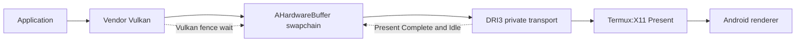
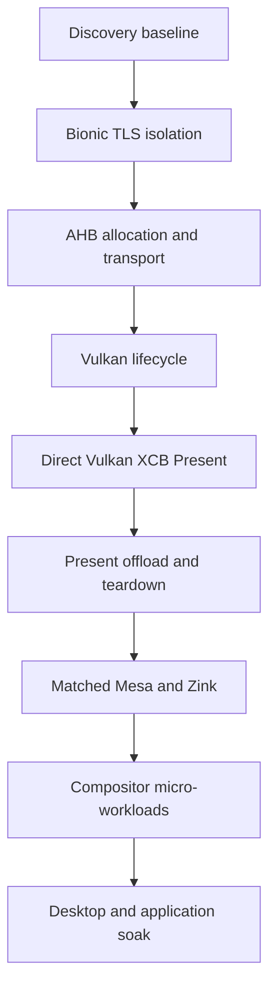

# WSI maturity tracker

The runtime keeps Ginkage and xMeM selectable. xMeM is the small upstream WSI
oracle being hardened here; passing it does not remove Ginkage or force an
installed distribution to use one acceleration route. Profile selection and
rollback remain explicit.

## Resolved in the Exynos proof

| Contract | State | Evidence |
| --- | --- | --- |
| Image memory requirements | Fixed | Allocation size and memory-type bits now come from the created Vulkan image |
| Cleanup initialization | Fixed | Memory, layout, pixmap, and AHB fields start in a safe empty state |
| Color encoding | Fixed | BGRA sRGB maps to RGBA sRGB instead of silently becoming UNORM |
| Channel semantics | Fixed | Paired modifier `1257` preserves RGBA content without a red/blue swap |
| Teardown wake | Fixed | A Present MSC notification wakes the event thread before join |
| Direct presentation | Pass | Mali-G72 red frame, clean exit, 1/1 Termux:X11 Present copies GPU-offloaded |

## Promotion gates still open

1. Query `VkExternalImageFormatProperties` and select BGRA or RGBA from actual
   export support instead of forcing RGBA on every driver.
2. Add bounded error handling to the AHardwareBuffer socket handshake so a
   dead peer cannot block the producer or X server indefinitely.
3. Carry acquire/release synchronization to X Present with an explicit fence.
   The current implementation is correct but waits a Vulkan fence on the CPU
   before Present, which can cost compositor latency.
4. Advertise only presentation modes whose semantics are implemented. MAILBOX
   needs real queued-frame replacement; until then FIFO is the release target.
5. Correctly handle resize, surface loss, retired swapchains, Present serial
   wrap, and X connection teardown under repeated stress.
6. Remove unnecessary sync-FD extension gates or use sync-FD end to end. The
   X11 backend currently checks external sync-FD support but uses a normal
   Vulkan presentation fence.
7. Version the paired private transport and reject mismatched WSI/server builds
   with a clear diagnostic rather than corrupted output.

## Qualification sequence

Every device/build pair advances independently:

No later pass erases an earlier failure. Performance results are compared only
between runs with the same resolution, presentation mode, thermal state, and
workload definition.
