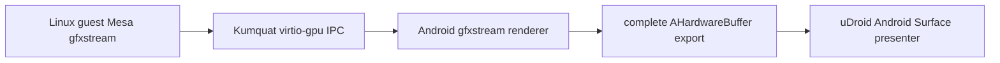

# Rootless gfxstream experiment

This experiment tests a second, optional acceleration route. It does not
replace the vendor-Vulkan/Zink or Panfrost profiles and must remain separately
selectable.



## Current checkpoint

The first headless experiment reached the Android renderer but reduced an
AHardwareBuffer to its first DMA-BUF file descriptor. That was sufficient for
a CPU-mappable compute probe, but it was not a valid display transport.

The locked `RandomCoderOrg/rutabaga_gfx` fork fixes the first truncation point.
Its additive C ABI exports every native-handle file descriptor plus the opaque
metadata emitted by AOSP nativewindow. The legacy single-handle export remains
unchanged. The fork also owns and closes exported descriptors through a paired
release function.

Fork commit:

```text
ee905f00e2ea00f39cc92a29d1e4edcab33f7036
feat(ffi): export complete AHardwareBuffer info
```

The fork tests three simultaneous descriptors, opaque metadata preservation,
descriptor lifetime, repeated release, non-empty output rejection, Clippy, and
C header compilation.

The integration repository adds a bounded internal process protocol in
`ahb-info-wire.c`. One `SOCK_SEQPACKET` record carries resource ID, generation,
all native-handle FDs through `SCM_RIGHTS`, and at most 64 KiB of opaque AOSP
metadata. The receiver rejects truncated ancillary data, mismatched FD counts,
unknown versions, invalid lengths, and reuse of a non-empty output object. All
received descriptors are close-on-exec and have one explicit release owner.

This is a same-device, same-build internal transport. AOSP's opaque native
handle metadata is not a stable serialization format, so it must never be
persisted, exposed as a public uDroid API, or replayed across app, renderer, or
APEX upgrades. Only resource identity and descriptor ownership cross the Unix
socket; frame pixels do not.

## Remaining display boundary

Full AHB export is necessary but does not make Kumquat a display server.
Upstream Kumquat currently converts every created blob to a single
`MagmaGpuHandle` and has no virtio-gpu scanout/display backend. The next
checkpoint is therefore a standard scanout lifecycle, not a resource-create
hook:

1. carry scanout assignment and frame-flush events through Kumquat;
2. retain complete AHB imports in an Android-side per-surface cache;
3. present the selected import into an app-owned Android `Surface`;
4. preserve buffer ownership until release completion;
5. validate resize, detach/reattach, resource destruction, and loss;
6. only then connect the path to uDroid's graphics-profile selector.

This follows Android crosvm's separation between resource export and display
presentation. Sending whichever blob was most recently created would not be a
correct substitute for scanout selection.

## Patch ownership

From this checkpoint onward, changes to an external project must be committed
to a GitHub fork under `RandomCoderOrg` and referenced here by an immutable
revision. The integration repository may carry build orchestration and tests,
but it must not hide new external-source edits as uncommitted build-directory
changes or newly generated patch files.

Unmodified dependencies may remain pinned directly to their upstream
repositories. Existing historical patch series are unchanged by this rule.

Validate the lock without network access:

```sh
python3 vendor-graphics/experiments/gfxstream/verify-source-lock.py
```
